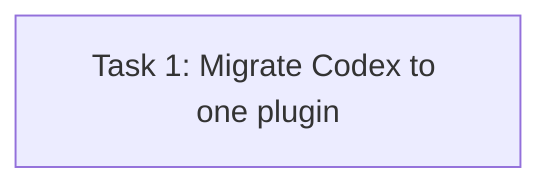

# Architecture Plan: Codex Plugin-Only Migration

## Execution Metadata

- **Status**: executed
- **Workflow Stage**: plan
- **Created**: 2026-07-17
- **Updated**: 2026-07-17
- **Source Of Truth Until**: implementation completes and this plan is marked `executed`, or the requirements change
- **Requirements Source**: `docs/anvil/brainstorms/2026-07-17-codex-plugin-migration.md`
- **Compounded Knowledge**: `docs/anvil/knowledge/tooling/safe-symlink-migration.md`

## Module Boundaries

### Module: Codex Plugin Package

- **Responsibility**: expose shared skills and lifecycle hooks from one repository-root plugin package.
- **Inputs**: plugin manifest, marketplace entry, root `skills/`, root `hooks/hooks.json`.
- **Outputs**: an installable `csl-agent-kit@csl-agent-market` bundle.
- **Dependencies**: current Codex plugin directory contract.
- **Invariants**: `.codex-plugin/` contains the required manifest; project-local `.agents/skills/` is outside the shared skill export; root hooks are the only Codex hook manifest.

### Module: Codex Installer Migration

- **Responsibility**: reinstall the plugin and remove only legacy CSL-owned shared-skill links after plugin installation succeeds.
- **Inputs**: selected CLI target, dry-run mode, package root, user home, Codex CLI availability.
- **Outputs**: deterministic command and cleanup change records.
- **Dependencies**: existing CLI target runner, command runner, path and filesystem standard library.
- **Invariants**: plugin installation precedes real cleanup; dry-run never mutates; non-symlinks and external symlinks are preserved; repeated runs are idempotent.

### Module: Verification Contract

- **Responsibility**: prove the plugin-only default, ownership-safe cleanup, compatibility, package contents, and live installed state.
- **Inputs**: CLI subprocess output, temporary homes, manifests, package dry-run, installed plugin cache.
- **Outputs**: focused test results and live verification evidence.
- **Dependencies**: Node test runner, Codex CLI, npm, JSON tools.
- **Invariants**: tests do not mutate the real home; the live migration runs only after focused and full checks pass.

## Interface Definitions

- `csl-agent-kit install --yes` selects `codex-plugin` as the only default Codex integration.
- `csl-agent-kit install --target codex-plugin` reports plugin commands plus any owned-link cleanup.
- Removed `codex-skills` input fails as an unknown target; old saved selections silently filter it out and retain valid targets.
- Cleanup change records use one explicit action name and include the removed target path for JSON and verbose output.
- Plugin hook commands resolve bundled scripts through `PLUGIN_ROOT`, with compatibility fallbacks for other supported plugin hosts and repository development.

## Logging Specification

- Keep the existing result object shape: `target`, `ok`, `changes` or `error`.
- Plugin command records remain `{ action: "command", command, status | dryRun }`.
- Legacy cleanup records contain `{ action: "remove", target, source, dryRun? }`.
- Default human output aggregates cleanup counts; verbose output prints each removed path.
- Errors remain deterministic single-line messages through the existing CLI error boundary.

## RTK Filter Presets

- Status and diff: `rtk git status --short`, `rtk git diff --check`, and scoped `rtk git diff -- <paths>`.
- Focused tests: `node --test tests/cli-install-output.test.js` directly because output is already bounded.
- Full checks: `rtk npm run check` when RTK supports the command; otherwise `env -u NO_COLOR npm run check` with bounded output.
- Package inspection: write `npm pack --dry-run --json` output to a temporary file and query only relevant paths.
- Live plugin inspection: filter `codex plugin list --json` to the CSL entry and inspect only the CSL cache subtree.

## Knowledge Probe

- **Policy source**: injected Anvil plan policy and `/anvil:plan` skill requirements.
- **Actual invocation**: an independent read-only agent checked `docs/anvil/knowledge/index.md`, enumerated `docs/anvil/knowledge/`, and attempted scoped discovery for the supplied modules, files, symbols, concepts, and symptom.
- **Ordered candidate ranking**: none because `docs/anvil/knowledge/` is absent.
- **Active matches**: 0.
- **Draft clues**: 0.
- **Relevant conflicts**: 0.
- **Unrelated conflicts**: 0.
- **Decision**: continue.

## Historical Constraints

- Repository task history proves that dual plugin-cache and global-symlink discovery previously caused duplicate skills.
- The new design must remove the dual source rather than reverse only half of the old workaround.
- Project-local workflows must remain separate from globally distributable skills.

## Critical Pattern Checks

- Current official Codex documentation supports root plugin packages with `.codex-plugin/plugin.json`, `skills/`, and default `hooks/hooks.json` discovery.
- Current official hook documentation supplies `PLUGIN_ROOT` and compatible root variables to plugin hook commands.
- The current installer already provides dry-run, JSON output, ordered external commands, and saved-selection filtering; reuse those paths.
- The current plugin-creator validator has a stale contradiction around explicit `hooks`, so rely on default hook discovery and avoid that field.

## Simplicity Audit

- No new package directory, migration framework, dependency, state file, or plugin abstraction is needed.
- One manifest export, one marketplace-root correction, one hook manifest, one cleanup helper, and existing command orchestration cover the migration.
- Cleanup runs after successful plugin installation, avoiding rollback machinery for partial failure.
- Deleting the obsolete Codex skill target and duplicate hook copy is smaller than maintaining compatibility aliases that would recreate the old model.

## Task DAG

## Parallel Execution Plan

| Layer | Parallel Group | Tasks | Execution | Reason |
|---|---|---|---|---|
| 1 | G1 | Task 1 | serial | One vertical slice changes a shared plugin, installer, tests, and migration contract. |

## Task List

### Task 1: Migrate Codex To One Plugin

- **Layer**: 1
- **Parallel Group**: G1
- **Execution**: serial
- **Parallel Blocker**: shared plugin, installer, test, and migration contracts must remain consistent in one accepted baseline.
- **Ownership**: `.codex-plugin/**`, `.agents/plugins/marketplace.json`, `hooks/hooks.json`, `bin/csl-agent-kit.js`, `tests/cli-install-output.test.js`, `tests/tips.test.mjs`, `README.md`, `tasks/todo.md`, `tasks/lessons.md`.
- **Read Set**: confirmed spec, current manifests, official plugin/hook contracts, current installer/tests/docs, installed plugin examples, repository task rules.
- **Write Set**: `.codex-plugin/plugin.json`, `.codex-plugin/hooks/hooks.json`, `.agents/plugins/marketplace.json`, `hooks/hooks.json`, `bin/csl-agent-kit.js`, `tests/cli-install-output.test.js`, `tests/tips.test.mjs`, `README.md`, `tasks/todo.md`, `tasks/lessons.md`.
- **Description**: deliver the full plugin-only migration: root plugin packaging, bundled shared skills, plugin-root hooks, removal of the Codex symlink target, post-install ownership-safe legacy-link cleanup, regression coverage, documentation, and topmost task/lesson records.
- **Success Criterion**: focused and full tests pass; isolated installation proves owned links are removed only after successful plugin installation while regular entries and external symlinks remain; package and plugin validation expose root skills/hooks; live reinstall yields one CSL shared-skill source and stable plugin identity.
- **Estimated Tokens**: 80k.
- **Dependencies**: none.
- **Files**: `.codex-plugin/plugin.json`, `.codex-plugin/hooks/hooks.json`, `.agents/plugins/marketplace.json`, `hooks/hooks.json`, `bin/csl-agent-kit.js`, `tests/cli-install-output.test.js`, `tests/tips.test.mjs`, `README.md`, `tasks/todo.md`, `tasks/lessons.md`.
- **Execution Instructions**: use default root hook discovery rather than an explicit `hooks` field; use Node standard library only; install the plugin before real cleanup; preserve plugin identity and every non-CSL-owned home entry; do not rewrite historical task records.
- **Code Status**: done.
- **Actual Write Set**: `.codex-plugin/plugin.json`, deleted `.codex-plugin/hooks/hooks.json`, `.agents/plugins/marketplace.json`, `hooks/hooks.json`, `bin/csl-agent-kit.js`, `tests/cli-install-output.test.js`, user-approved `tests/tips.test.mjs`, `README.md`, `tasks/todo.md`, `tasks/lessons.md`, and the required Anvil spec/plan/review/knowledge artifacts.
- **Verification**: Node 22 project checks passed 52/52; package dry-run contained 132 expected entries; recursive skill listing found 27 shared skills; JSON and diff validation passed; hook commands executed from both plugin-root variables; live Codex reinstall succeeded and removed only legacy owned links.
- **Evidence**: implementation and tests in the actual write set; live `codex plugin list --json`; package/list outputs captured in the sole final review report.

## Session Split Points

- No split expected; the one implementation task is estimated below 100k tokens and the full workflow remains far below the 3M checkpoint.
- If verification produces unexpectedly large logs, retain only counters and matched windows before continuing.

## Pass Conditions

- [x] All module invariants hold and the DAG remains acyclic.
- [x] Every task's write set stays within ownership, including the user-approved test fixture expansion.
- [x] Shared plugin/config/test contracts were executed serially.
- [x] Focused and full checks passed before live migration.
- [x] Live plugin state demonstrates one shared-skill source and functioning plugin-root hooks.
- [x] Review, Yao audit, and knowledge gates completed before final handoff.
