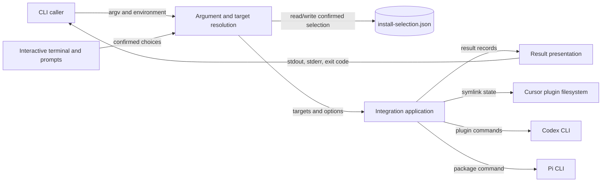

# CLI 安装组件当前状态地图

## 1. Scope Summary

- `Scope`：`bin/csl-agent-kit.js`
- `HEAD`：`05a6c689e2344dc925b7dc111f02aa03750114f6`
- `Working tree`：`clean`
- `Generated at`：`2026-07-19T22:18:17+0800`

该文件是 npm 暴露的 `csl-agent-kit` 可执行入口，也由兼容脚本转发调用；它服务于希望把当前工具包接入 Cursor、Codex 或 Pi 的终端用户与自动化调用方（`package.json#bin`，`scripts/install.sh:6`）。组件接收 `install` 子命令、选项、TTY/CI 与环境状态，解析并选择 integration target，执行或预演文件系统及外部 CLI 操作，最后交付人类摘要或 JSON 结果与进程退出码（`bin/csl-agent-kit.js#main`）。它不实现 Cursor、Codex 或 Pi 自身，也不定义被安装的 skills/hooks 内容；这些平台和仓库内容只是它调用或交付的直接边界（`bin/csl-agent-kit.js#installCursor`，`bin/csl-agent-kit.js#installCodexPlugin`，`bin/csl-agent-kit.js#installPi`）。

## 2. Domain Glossary

| Term | Meaning here | Not the same as | Evidence |
| --- | --- | --- | --- |
| target | `cursor`、`codex-plugin`、`pi` 三种安装 integration；每项绑定展示信息、默认性、外部命令属性和执行函数 | 文件系统目标路径 | `bin/csl-agent-kit.js#targets` |
| external | 交互选择后是否需要额外确认会调用外部 CLI；当前为 `codex-plugin` 与 `pi` | 所有可能访问仓库外状态的操作；Cursor 虽修改用户目录但标记为 `false` | `bin/csl-agent-kit.js#targets`，`bin/csl-agent-kit.js#resolveInstallTargets` |
| change | target 执行返回的结构化动作记录，如 `command`、`symlink`、`remove`、`skip`；dry-run 时记录计划动作 | Git diff 或“必然已完成”的变更 | `bin/csl-agent-kit.js#runCommands`，`bin/csl-agent-kit.js#ensureSymlink`，`bin/csl-agent-kit.js#summarizeChanges` |

## 3. Functional Module Map



| Module | What it does | Inputs | Outputs | Owns | Code anchor | Tests |
| --- | --- | --- | --- | --- | --- | --- |
| Argument and target resolution | 将命令行 token 归一化为 options；按 `all`、显式 targets、`yes`、交互选择的优先级得到有序且去重的 target 集合；交互路径复用并保存已确认选择 | `argv`、TTY/CI、环境变量、选择文件、prompt 响应 | options 与 target 名称列表，或参数/交互错误退出 | 参数语义、target 有效集合、交互确认、选择文件格式与位置 | `bin/csl-agent-kit.js#parseInstallArgs`，`bin/csl-agent-kit.js#resolveInstallTargets`，`bin/csl-agent-kit.js#loadInstallSelection`，`bin/csl-agent-kit.js#saveInstallSelection` | `tests/cli-install-output.test.js:232`，`tests/cli-install-output.test.js:250`，`tests/cli-install-output.test.js:268`，`tests/cli-install-output.test.js:450` |
| Integration application | 按选择顺序派发 target；为 Cursor 管理 repo-root symlink，为 Codex 编排 plugin 迁移并清理本包旧 skill links，为 Pi 调用 package 安装；将实际动作或 dry-run 计划统一成 change records | target 列表、options、仓库根、用户目录与外部 CLI 状态 | 每个 target 的 `{ok, changes}` 或 `{ok: false, error}` | target registry、平台动作顺序、legacy link 归属判断、单 target 失败隔离 | `bin/csl-agent-kit.js#targets`，`bin/csl-agent-kit.js#installTargets`，`bin/csl-agent-kit.js#installCursor`，`bin/csl-agent-kit.js#installCodexPlugin`，`bin/csl-agent-kit.js#installPi`，`bin/csl-agent-kit.js#removeLegacyCodexSkillLinks` | `tests/cli-install-output.test.js:59`，`tests/cli-install-output.test.js:324`，`tests/cli-install-output.test.js:354`，`tests/cli-install-output.test.js:377`，`tests/cli-install-output.test.js:426` |
| Result presentation | 把 result records 投影为无颜色 JSON 或带可选颜色、verbose 细节的人类摘要，并按全部 target 是否成功决定最终状态 | results、`json`、`verbose`、`dryRun`、color mode | stdout 摘要/JSON 与退出码 `0` 或 `1` | 输出 schema、动作计数措辞、ANSI 策略、聚合完成状态 | `bin/csl-agent-kit.js#main`，`bin/csl-agent-kit.js#printResults`，`bin/csl-agent-kit.js#summarizeChanges`，`bin/csl-agent-kit.js#createColors` | `tests/cli-install-output.test.js:44`，`tests/cli-install-output.test.js:200`，`tests/cli-install-output.test.js:208`，`tests/cli-install-output.test.js:215`，`tests/cli-install-output.test.js:222` |

## 4. Core Working Flows

### 4.1 非交互安装或预演

```text
install 触发 → argv / 环境 → 参数与 target 解析 → integration 派发 → 外部状态或计划记录 → 摘要/JSON 与退出码
                                      └→ 参数错误退出 2；单 target 异常记为失败，最终退出 1
```

1. npm bin 或兼容 wrapper 最终进入 `main`；只有 `install` 进入安装链，其他命令打印总帮助（`package.json#bin`，`scripts/install.sh:6`，`bin/csl-agent-kit.js#main`）。
2. Argument and target resolution 解析 flags 与位置 target；`--all` 直接选择 registry 全集，显式列表会先验证再去重，`--yes` 只取默认项，当前即 `codex-plugin`。缺少 `--target` 值、未知选项或未知 target 经 `die` 输出错误并退出 `2`（`bin/csl-agent-kit.js#parseInstallArgs`，`bin/csl-agent-kit.js#resolveInstallTargets`，`bin/csl-agent-kit.js#validateTargets`，`bin/csl-agent-kit.js#die`）。
3. Integration application 按 target 顺序逐项调用 `spec.run`，把同步异常捕获到该 target 的失败 result，并继续处理后续项（`bin/csl-agent-kit.js#installTargets`）。
   - Cursor：dry-run 只返回 symlink 计划；实际执行时创建父目录，保留已指向 repo root 的链接，替换其他 symlink，但拒绝覆盖普通文件（`bin/csl-agent-kit.js#installCursor`，`bin/csl-agent-kit.js#ensureSymlink`）。
   - Codex：实际执行但找不到 `codex` 时返回 `skip`；否则按既定顺序移除旧 identity/marketplace、添加 repo-root marketplace 与唯一默认 plugin，再处理 legacy skill links（`bin/csl-agent-kit.js#installCodexPlugin`）。
   - Pi：实际执行但找不到 `pi` 时返回 `skip`，否则从 repo root 调用 `pi install`；dry-run 直接形成命令计划（`bin/csl-agent-kit.js#installPi`，`bin/csl-agent-kit.js#runCommands`）。
4. Result presentation 在 JSON 路径输出顶层 `ok` 与 results；人类路径按 action 计数，只有 verbose 才展开路径/命令。全部 result 成功退出 `0`，任一失败退出 `1`（`bin/csl-agent-kit.js#main`，`bin/csl-agent-kit.js#printResults`；直接测试：`tests/cli-install-output.test.js:44`，`tests/cli-install-output.test.js:222`）。

### 4.2 交互选择与确认状态持久化

```text
无选择 flag → TTY / CI 与历史选择 → 交互 checklist → 外部 target 确认 → 原子保存选择 → 安装结果
                   └→ 非 TTY、依赖缺失、取消或拒绝外部命令时退出 2；保存失败仅警告
```

1. 只有 `all`、显式 targets 与 `yes` 均未命中时才进入交互；非 TTY 或 CI 环境立即要求改用非交互 flag，加载不到 `prompts` 也退出 `2`（`bin/csl-agent-kit.js#resolveInstallTargets`）。
2. 选择文件来自 `CSL_AGENT_KIT_HOME` 或 `~/.csl-agent-kit/install-selection.json`。读取失败、schema 非 version 1、或过滤后没有现存 target 时返回 `null`，checklist 因而回退到 registry 默认项；有效历史值只保留当前 registry 中的名称（`bin/csl-agent-kit.js#installSelectionFile`，`bin/csl-agent-kit.js#loadInstallSelection`，`bin/csl-agent-kit.js#buildInstallChoices`；直接测试：`tests/cli-install-output.test.js:232`，`tests/cli-install-output.test.js:250`，`tests/cli-install-output.test.js:288`，`tests/cli-install-output.test.js:306`）。
3. checklist 至少选择一项；若包含标记为 external 的 target，会出现第二次确认。取消或未确认会在任何 target 派发前退出 `2`（`bin/csl-agent-kit.js#resolveInstallTargets`）。
4. 已确认选择会过滤为当前有效 targets，以 `0600` 临时文件写入后 rename；写入失败只产生 warning，仍返回本次选择并继续安装。显式 target 路径在此前已经返回，因此不会改写交互历史（`bin/csl-agent-kit.js#saveInstallSelection`，`bin/csl-agent-kit.js#resolveInstallTargets`；直接测试：`tests/cli-install-output.test.js:450`）。

### 4.3 Codex plugin 迁移与 owned legacy link 清理

```text
选择 codex-plugin → options / Codex 可用性 → plugin 命令序列 → owned-link 判定与清理 → changes
                                              └→ 必须成功的 add 命令失败时停止，legacy links 保持不动
```

1. dry-run 跳过 CLI 可用性探测并把八条 plugin 命令全部记录为计划；实际路径若 `codex --version` 不成功则返回一个成功 result 内的 `skip` change，不执行迁移（`bin/csl-agent-kit.js#installCodexPlugin`，`bin/csl-agent-kit.js#hasCommand`；命令序列测试：`tests/cli-install-output.test.js:59`）。
2. 六条兼容性 remove 命令允许失败；repo-root marketplace add 与 `csl-agent-kit@csl-agent-market` plugin add 必须成功。`runCommands` 在必须成功的命令失败时抛错，所以随后的 legacy cleanup 不会开始（`bin/csl-agent-kit.js#installCodexPlugin`，`bin/csl-agent-kit.js#runCommands`；直接测试：`tests/cli-install-output.test.js:426`）。
3. cleanup 只枚举真实的 `~/.agents/skills` 目录；目录本身是 symlink 或不是目录时不遍历。子项只有是 symlink，且文本 source 或可解析 real source 位于当前仓库 `skills/` 内时，才会报告或执行删除；普通项、外部链接与外部 broken link 保留（`bin/csl-agent-kit.js#removeLegacyCodexSkillLinks`，`bin/csl-agent-kit.js#isWithin`；直接测试：`tests/cli-install-output.test.js:324`，`tests/cli-install-output.test.js:354`，`tests/cli-install-output.test.js:377`）。
4. cleanup changes 与前序命令 changes 合并为 Codex result；重复执行时已删项不再产生 remove，因此清理具备可观察幂等性（`bin/csl-agent-kit.js#installCodexPlugin`；直接测试：`tests/cli-install-output.test.js:377`）。

## 5. Cross-flow Invariants

- **平台 dry-run 不改变安装目标状态**：`runCommands`、`ensureSymlink` 与 legacy cleanup 都在变更前检查 `options.dryRun` 并返回带 `dryRun: true` 的 change；违反会让“install preview”执行真实安装或删除。交互选择文件是独立的确认状态，不属于这一平台动作保证（`bin/csl-agent-kit.js#runCommands`，`bin/csl-agent-kit.js#ensureSymlink`，`bin/csl-agent-kit.js#removeLegacyCodexSkillLinks`）。
- **target 失败隔离、进程结果聚合**：每个 `spec.run` 的异常只把对应 result 标为失败，后续 targets 仍继续；最终退出码和 JSON 顶层 `ok` 再依据所有 results 计算。违反会使单个平台失败与整体结果互相矛盾（`bin/csl-agent-kit.js#installTargets`，`bin/csl-agent-kit.js#main`）。
- **保存的选择只控制下一次交互预选**：`all`、显式 targets、`yes` 都在读取选择文件前返回；只有完成交互确认的选择才尝试保存。违反会把一次性命令意外变成持久偏好（`bin/csl-agent-kit.js#resolveInstallTargets`；直接测试：`tests/cli-install-output.test.js:450`）。
