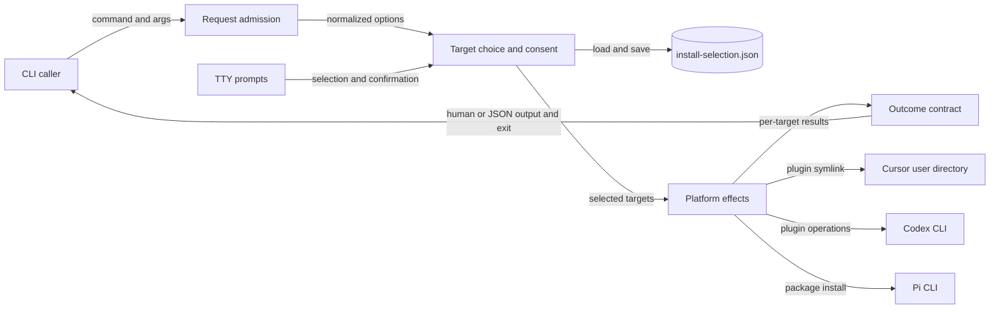

# CSL Agent Kit CLI 安装组件地图

## 1. Scope Summary

- `Scope`：`bin/csl-agent-kit.js`
- `HEAD`：`05a6c689e2344dc925b7dc111f02aa03750114f6`
- `Working tree`：`clean`
- `Generated at`：`2026-07-19T22:41:38+0800`

该组件是 `csl-agent-kit` npm bin 的 Node 入口，旧安装脚本也把参数转交给它；直接调用方是终端用户、shell wrapper 与自动化进程（`package.json#bin`，`scripts/install.sh:6`）。它接收 command/argv、TTY/CI、环境变量和交互选择状态，负责接纳安装请求、确定 Cursor/Codex/Pi targets、编排平台动作或 dry-run，并以文本或 JSON 交付逐 target 结果与退出状态（`bin/csl-agent-kit.js#main`）。它不实现平台 CLI、plugin 内容或 Pi package 内容；这些只是被调用或被安装的外部边界，repo root 才是交付载荷（`bin/csl-agent-kit.js#installCodexPlugin`，`bin/csl-agent-kit.js#installPi`）。

## 2. Domain Glossary

| Term | Meaning here | Not the same as | Evidence |
| --- | --- | --- | --- |
| `skip` | 实际安装时找不到 Codex/Pi CLI 所产生的成功 change record | target failure；它仍位于 `ok: true` result 中 | `bin/csl-agent-kit.js#installCodexPlugin`，`bin/csl-agent-kit.js#installPi`，`bin/csl-agent-kit.js#installTargets` |
| owned legacy link | `~/.agents/skills` 下的 symlink，其文本 source 或解析后 source 位于本仓库真实 `skills/` 根内 | 同目录的普通文件、目录或外部 symlink | `bin/csl-agent-kit.js#removeLegacyCodexSkillLinks`，`bin/csl-agent-kit.js#isWithin` |

## 3. Functional Module Map



| Module | What it does | Inputs | Outputs | Owns | Code anchor | Tests |
| --- | --- | --- | --- | --- | --- | --- |
| Request admission | 区分安装请求与帮助请求，将安装 tokens 解析成稳定 options；无效 option 或缺值立即终止 | command、argv | help 输出或 options | 命令入口、flag aliases、位置 target 与错误退出 `2` | `bin/csl-agent-kit.js#main`，`bin/csl-agent-kit.js#parseInstallArgs`，`bin/csl-agent-kit.js#splitTargets`，`bin/csl-agent-kit.js#die` | `tests/cli-install-output.test.js:268`，`tests/cli-install-output.test.js:276` |
| Target choice and consent | 按固定优先级选择、验证和去重 targets；无显式选择时管理 TTY checklist、external confirmation 与历史预选 | options、TTY/CI、prompt 响应、selection JSON | 有序 target 列表或交互退出 | registry 有效名称、默认项、external consent、version 1 selection 状态 | `bin/csl-agent-kit.js#targets`，`bin/csl-agent-kit.js#resolveInstallTargets`，`bin/csl-agent-kit.js#loadInstallSelection`，`bin/csl-agent-kit.js#saveInstallSelection` | `tests/cli-install-output.test.js:232`，`tests/cli-install-output.test.js:250`，`tests/cli-install-output.test.js:288`，`tests/cli-install-output.test.js:306`，`tests/cli-install-output.test.js:450` |
| Platform effects | 依次运行 target adapter，把文件系统/外部命令效果或预演描述统一成 changes；单 target 异常转换为失败 result | selected targets、options、repo root、用户目录、外部 CLI | `{target, ok, changes}` 或 `{target, ok: false, error}` | Cursor symlink、Codex plugin 迁移和 legacy cleanup、Pi install、dry-run effect boundary | `bin/csl-agent-kit.js#installTargets`，`bin/csl-agent-kit.js#installCursor`，`bin/csl-agent-kit.js#installCodexPlugin`，`bin/csl-agent-kit.js#installPi`，`bin/csl-agent-kit.js#runCommands` | `tests/cli-install-output.test.js:59`，`tests/cli-install-output.test.js:324`，`tests/cli-install-output.test.js:354`，`tests/cli-install-output.test.js:377`，`tests/cli-install-output.test.js:426` |
| Outcome contract | 把同一 results 投影为机器 JSON 或按 action 计数的终端摘要，并从所有 result 的成功性计算进程状态 | results、json/verbose/color/dry-run options | stdout/stderr 与退出码 `0`/`1` | JSON schema、人类摘要、ANSI 与 detail policy、总体成功定义 | `bin/csl-agent-kit.js#main`，`bin/csl-agent-kit.js#printResults`，`bin/csl-agent-kit.js#summarizeChanges`，`bin/csl-agent-kit.js#createColors` | `tests/cli-install-output.test.js:44`，`tests/cli-install-output.test.js:78`，`tests/cli-install-output.test.js:200`，`tests/cli-install-output.test.js:208`，`tests/cli-install-output.test.js:215`，`tests/cli-install-output.test.js:222` |

## 4. Core Working Flows

### 4.1 从非交互请求到平台结果

```text
CLI install → argv/options → request admission → target choice → platform effects → results → 输出与退出码
                    └→ 参数/target 无效时退出 2；adapter 异常成为失败 result，整体退出 1
```

1. npm bin 与兼容 wrapper 都进入 `main`；`install` 之外的 command 只打印总帮助。安装路径先解析 `--all`、`--target(s)`、`--yes`、dry-run、输出和颜色 flags（`package.json#bin`，`scripts/install.sh:6`，`bin/csl-agent-kit.js#main`，`bin/csl-agent-kit.js#parseInstallArgs`）。
2. Target choice 按 `all` → 非空显式列表 → `yes` → interactive 的顺序短路：`all` 保持 registry 顺序，显式列表先验证再按首次出现去重，`yes` 只取 `default: true` 的 `codex-plugin`（`bin/csl-agent-kit.js#resolveInstallTargets`，`bin/csl-agent-kit.js#validateTargets`）。
3. Platform effects 依选择顺序调用 `spec.run`，捕获每个 adapter 的同步异常而不停止后续 target；因此 results 保持选择顺序并可同时包含成功与失败（`bin/csl-agent-kit.js#installTargets`）。
4. 三种 adapter 将不同边界归一为 changes：Cursor 规划或确保 repo-root symlink；Codex 规划或运行 plugin 迁移后清理 owned links；Pi 规划或运行 `pi install <repoRoot>`。实际路径缺少 Codex/Pi CLI 时返回 `skip`，而不是抛错（`bin/csl-agent-kit.js#installCursor`，`bin/csl-agent-kit.js#installCodexPlugin`，`bin/csl-agent-kit.js#installPi`）。
5. Outcome contract 对同一 results 选择 JSON 或人类输出；顶层 `ok` 与退出码都由 `results.every(item.ok)` 得到（`bin/csl-agent-kit.js#main`，`bin/csl-agent-kit.js#printResults`；直接测试：`tests/cli-install-output.test.js:44`，`tests/cli-install-output.test.js:222`）。

### 4.2 交互同意与历史选择

```text
无 all/targets/yes → TTY 与历史 JSON → checklist → external consent → 原子保存 → platform effects
                         └→ 非 TTY/CI、prompts 缺失、取消或拒绝确认时退出 2
```

1. 无非交互选择时，非 TTY 或 CI 会先失败；可交互环境才动态加载 `prompts`（`bin/csl-agent-kit.js#resolveInstallTargets`）。
2. selection 文件位于 `CSL_AGENT_KIT_HOME/install-selection.json`，未设置时落到 `~/.csl-agent-kit/`。读取只接受 version 1 数组，再按当前 registry 过滤；读取/解析失败或无有效名称均回退到默认预选（`bin/csl-agent-kit.js#installSelectionFile`，`bin/csl-agent-kit.js#loadInstallSelection`，`bin/csl-agent-kit.js#buildInstallChoices`；直接测试：`tests/cli-install-output.test.js:250`，`tests/cli-install-output.test.js:288`）。
3. `codex-plugin` 与 `pi` 的 `external: true` 使选中它们时出现 confirm；Cursor 不触发该确认。取消或拒绝发生在保存和 adapter 派发之前（`bin/csl-agent-kit.js#targets`，`bin/csl-agent-kit.js#resolveInstallTargets`）。
4. 确认后的有效选择通过同目录临时文件、mode `0600` 和 rename 保存；保存失败只输出 warning，本次选择仍继续。因为非交互路径均已短路，它们不会读写该历史（`bin/csl-agent-kit.js#saveInstallSelection`，`bin/csl-agent-kit.js#resolveInstallTargets`；直接测试：`tests/cli-install-output.test.js:232`，`tests/cli-install-output.test.js:450`）。

### 4.3 Codex plugin 迁移的提交边界

```text
codex-plugin → CLI 可用性 → remove/add 命令序列 → owned legacy-link cleanup → 合并 changes
                                      └→ required add 失败时抛错，cleanup 尚未开始
```

1. 非 dry-run 先以 `codex --version` 探测命令；不可用时用 `skip` 完成本 target。dry-run 跳过探测并描述完整命令序列（`bin/csl-agent-kit.js#installCodexPlugin`，`bin/csl-agent-kit.js#hasCommand`；计划顺序测试：`tests/cli-install-output.test.js:59`）。
2. 六条旧 identity/marketplace removals 标为 allow-failure；repo-root marketplace add 和唯一 plugin add 必须成功。required command 非零时 `runCommands` 抛错，`installTargets` 把错误收进失败 result（`bin/csl-agent-kit.js#runCommands`，`bin/csl-agent-kit.js#installTargets`）。
3. cleanup 只在整个命令序列返回后执行，所以 required add 失败保留 legacy links。成功后，仅遍历非 symlink 的真实 `~/.agents/skills` 目录，并只删除 source 或 resolved source 位于真实 repo `skills/` 根内的 symlink（`bin/csl-agent-kit.js#installCodexPlugin`，`bin/csl-agent-kit.js#removeLegacyCodexSkillLinks`，`bin/csl-agent-kit.js#isWithin`；直接测试：`tests/cli-install-output.test.js:354`，`tests/cli-install-output.test.js:426`）。
4. dry-run 为 owned links 产生 remove plans 而不 unlink；实际成功清理后再次执行不再报告这些项，形成可观察幂等结果（`bin/csl-agent-kit.js#removeLegacyCodexSkillLinks`；直接测试：`tests/cli-install-output.test.js:324`，`tests/cli-install-output.test.js:377`）。

## 5. Cross-flow Invariants

- **Registry 是选择、展示与执行的共同真源**：`Object.keys/entries(targets)` 同时驱动 `all`、默认项、历史过滤、交互 choices、帮助内容与 adapter lookup。违反会造成可选择 target 与可执行 target 不一致（`bin/csl-agent-kit.js#targets`，`bin/csl-agent-kit.js#resolveInstallTargets`，`bin/csl-agent-kit.js#buildInstallChoices`，`bin/csl-agent-kit.js#printInstallHelp`）。
- **dry-run 约束平台效果，不冻结交互偏好**：`ensureSymlink`、`runCommands` 与 legacy cleanup 在平台变更前返回计划记录；但交互确认后的 selection 仍会尝试保存。违反前半条会让 preview 改变安装状态，把后半条误当保证则会错误理解 selection 文件（`bin/csl-agent-kit.js#ensureSymlink`，`bin/csl-agent-kit.js#runCommands`，`bin/csl-agent-kit.js#removeLegacyCodexSkillLinks`，`bin/csl-agent-kit.js#saveInstallSelection`）。
- **三层失败保持不同契约**：参数/交互拒绝经 `die` 退出 `2`；adapter 异常成为 `ok: false` 并最终退出 `1`；缺少外部 CLI 则是成功 result 内的 `skip`。合并这些语义会使自动化调用方误判状态（`bin/csl-agent-kit.js#die`，`bin/csl-agent-kit.js#installTargets`，`bin/csl-agent-kit.js#installCodexPlugin`，`bin/csl-agent-kit.js#main`）。
