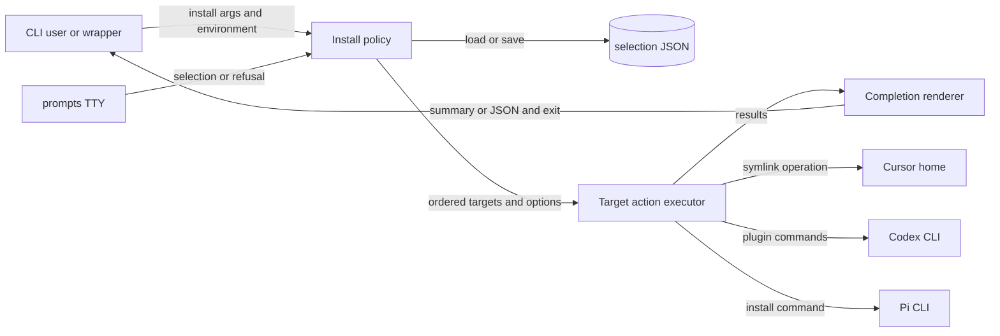

# CLI 安装组件开发地图

## 1. Scope Summary

- `Scope`：`bin/csl-agent-kit.js`
- `HEAD`：`05a6c689e2344dc925b7dc111f02aa03750114f6`
- `Working tree`：`clean`
- `Generated at`：`2026-07-19T22:54:59+0800`

`bin/csl-agent-kit.js` 是 npm 注册的 `csl-agent-kit` 命令入口，也是 `scripts/install.sh` 的最终执行对象；它面向终端用户及自动化调用方（`package.json#bin`，`scripts/install.sh:6`）。组件接收 install argv、TTY/CI、HOME/配置目录和交互响应，决定要处理的 integrations，执行或预演 Cursor symlink、Codex plugin、Pi package 动作，再返回文本或 JSON 结果和退出码（`bin/csl-agent-kit.js#main`）。它不提供被安装的 skills/hooks，也不实现 Codex、Pi 或 Cursor；它只把 repo root 交给这些边界或链接到用户目录（`bin/csl-agent-kit.js#installCursor`，`bin/csl-agent-kit.js#installCodexPlugin`，`bin/csl-agent-kit.js#installPi`）。

## 2. Domain Glossary

| Term | Meaning here | Not the same as | Evidence |
| --- | --- | --- | --- |
| default target | `--yes` 选择且无历史值时 checklist 预选的 target；当前只有 `codex-plugin` | 唯一合法 target；显式选择与 `--all` 仍可选 Cursor/Pi | `bin/csl-agent-kit.js#targets`，`bin/csl-agent-kit.js#resolveInstallTargets`，`bin/csl-agent-kit.js#buildInstallChoices` |
| external target | 交互路径中需要第二次确认的 target；当前是 Codex/Pi | dry-run 标记或“会修改任何外部文件”的通用分类；Cursor 修改 HOME 但 `external: false` | `bin/csl-agent-kit.js#targets`，`bin/csl-agent-kit.js#resolveInstallTargets` |
| allowed failure | Codex 兼容性 remove 命令可返回非零而不中止迁移 | target 成功；状态仍记录在 command change 中 | `bin/csl-agent-kit.js#installCodexPlugin`，`bin/csl-agent-kit.js#runCommands` |

## 3. Functional Module Map



| Module | What it does | Inputs | Outputs | Owns | Code anchor | Tests |
| --- | --- | --- | --- | --- | --- | --- |
| Install policy | 解析 install flags，基于 registry 选择并验证 targets；只有交互路径读取历史预选、请求 external consent 并保存确认结果 | argv、TTY/CI、环境、selection JSON、prompt response | options 与有序、去重 target 名称，或退出 `2` | target policy、选择优先级、交互授权、selection schema/位置 | `bin/csl-agent-kit.js#targets`，`bin/csl-agent-kit.js#parseInstallArgs`，`bin/csl-agent-kit.js#resolveInstallTargets`，`bin/csl-agent-kit.js#loadInstallSelection`，`bin/csl-agent-kit.js#saveInstallSelection` | `tests/cli-install-output.test.js:232`，`tests/cli-install-output.test.js:250`，`tests/cli-install-output.test.js:268`，`tests/cli-install-output.test.js:288`，`tests/cli-install-output.test.js:306`，`tests/cli-install-output.test.js:450` |
| Target action executor | 按 policy 顺序派发 Cursor/Codex/Pi adapter；把真实动作或 dry-run 计划统一为 changes，把每个 adapter 的异常隔离到对应 result | targets、options、repo root、用户目录、外部命令状态 | 成功 `{target, ok, changes}` 或失败 `{target, ok: false, error}` | 三个平台的动作语义、命令顺序、legacy-link ownership 与 effect boundary | `bin/csl-agent-kit.js#installTargets`，`bin/csl-agent-kit.js#installCursor`，`bin/csl-agent-kit.js#installCodexPlugin`，`bin/csl-agent-kit.js#installPi`，`bin/csl-agent-kit.js#ensureSymlink`，`bin/csl-agent-kit.js#removeLegacyCodexSkillLinks` | `tests/cli-install-output.test.js:59`，`tests/cli-install-output.test.js:324`，`tests/cli-install-output.test.js:354`，`tests/cli-install-output.test.js:377`，`tests/cli-install-output.test.js:426` |
| Completion renderer | 将 results 输出为稳定 JSON 或紧凑终端摘要；控制 ANSI/verbose 展开并计算整体成功 | results 与 json、verbose、color、dry-run options | stdout/stderr 与退出码 `0`/`1` | JSON envelope、action 汇总措辞、颜色策略、总体完成条件 | `bin/csl-agent-kit.js#main`，`bin/csl-agent-kit.js#printResults`，`bin/csl-agent-kit.js#summarizeChanges`，`bin/csl-agent-kit.js#createColors` | `tests/cli-install-output.test.js:44`，`tests/cli-install-output.test.js:78`，`tests/cli-install-output.test.js:200`，`tests/cli-install-output.test.js:208`，`tests/cli-install-output.test.js:215`，`tests/cli-install-output.test.js:222` |

## 4. Core Working Flows

### 4.1 选择策略到执行队列

```text
install → argv / TTY / history → Install policy → target queue → Target action executor → results
                              └→ 缺值、未知 option/target、不可交互时退出 2
```

1. `main` 只让 `install` 进入该链；其他 command 打印总帮助。安装参数被解析为 `all`、targets、`yes`、dry-run 和呈现 options；`--target` 缺值或未知 option 经 `die` 直接退出 `2`（`bin/csl-agent-kit.js#main`，`bin/csl-agent-kit.js#parseInstallArgs`，`bin/csl-agent-kit.js#die`）。
2. Policy 依次检查 `all`、非空显式 targets、`yes`、interactive：`all` 使用 registry 全集；显式 targets 验证后按首次出现去重；`yes` 只选 `default`；前三条都不读取 selection 文件（`bin/csl-agent-kit.js#resolveInstallTargets`，`bin/csl-agent-kit.js#validateTargets`）。
3. Executor 依队列调用 registry 中的 `run`，每项用独立 try/catch 形成 result；某项抛错不会阻止后续项（`bin/csl-agent-kit.js#installTargets`）。
4. Cursor 生成或执行 repo-root symlink；Codex 生成或执行迁移序列；Pi 生成或执行 `pi install <repoRoot>`。实际模式找不到 Codex/Pi CLI 时，adapter 返回 `skip` change，因此该 result 仍成功（`bin/csl-agent-kit.js#installCursor`，`bin/csl-agent-kit.js#installCodexPlugin`，`bin/csl-agent-kit.js#installPi`）。

### 4.2 交互授权与 selection 状态

```text
无 all/targets/yes → TTY + saved selection → checklist → external confirmation → selection replace → target queue
                         └→ CI/非 TTY、prompts 缺失、取消或拒绝确认时退出 2
```

1. 只有前三种选择策略均未返回才进入交互。CI 或非 TTY 被拒绝；随后才加载 `prompts`（`bin/csl-agent-kit.js#resolveInstallTargets`）。
2. `CSL_AGENT_KIT_HOME` 覆盖默认的 `~/.csl-agent-kit`。读取只接受 version 1 的数组，并按当前 registry 过滤；无有效项时 checklist 使用 default target（`bin/csl-agent-kit.js#installSelectionFile`，`bin/csl-agent-kit.js#loadInstallSelection`，`bin/csl-agent-kit.js#buildInstallChoices`；直接测试：`tests/cli-install-output.test.js:250`，`tests/cli-install-output.test.js:288`）。
3. 选中任一 external target 才显示 confirm。取消或拒绝会在 selection 写入和 target 执行前退出；只选 Cursor 不触发第二次确认（`bin/csl-agent-kit.js#targets`，`bin/csl-agent-kit.js#resolveInstallTargets`）。
4. 通过确认后，selection 先过滤有效名称，再以 mode `0600` 写同目录临时文件并 rename；保存异常只 warning，不取消本次执行。dry-run 不抑制这一偏好写入（`bin/csl-agent-kit.js#saveInstallSelection`，`bin/csl-agent-kit.js#resolveInstallTargets`；直接测试：`tests/cli-install-output.test.js:232`，`tests/cli-install-output.test.js:450`）。

### 4.3 Codex 安装与 legacy cleanup

```text
codex-plugin → dry-run / CLI probe → remove/add commands → owned-link cleanup → command + remove changes
                                           └→ required add 失败时 adapter 抛错，cleanup 不执行
```

1. dry-run 跳过 `codex --version` 并把八条命令写为计划；实际路径探测失败则返回一个 `skip` change（`bin/csl-agent-kit.js#installCodexPlugin`，`bin/csl-agent-kit.js#hasCommand`；顺序测试：`tests/cli-install-output.test.js:59`）。
2. 六条旧 identity/marketplace remove 允许失败；repo-root marketplace add 与 `csl-agent-kit@csl-agent-market` add 必须成功。required command 非零时 `runCommands` 抛错（`bin/csl-agent-kit.js#installCodexPlugin`，`bin/csl-agent-kit.js#runCommands`）。
3. cleanup 位于命令序列成功返回之后；所以 required add 失败时 legacy links 原样保留。成功后，只遍历真实的非 symlink `~/.agents/skills` 目录，只处理 symlink child，并要求文本 source 或 resolved source 位于真实 repo `skills/` 内（`bin/csl-agent-kit.js#removeLegacyCodexSkillLinks`，`bin/csl-agent-kit.js#isWithin`；直接测试：`tests/cli-install-output.test.js:354`，`tests/cli-install-output.test.js:426`）。
4. dry-run 对 owned links 返回 remove plans 而不 unlink；实际成功删除后重复执行不会再返回 removes（`bin/csl-agent-kit.js#removeLegacyCodexSkillLinks`；直接测试：`tests/cli-install-output.test.js:324`，`tests/cli-install-output.test.js:377`）。

### 4.4 Results 到调用方契约

```text
target results → Completion renderer → JSON 或人类摘要 → exit 0/1
                         └→ 单项失败仍可输出其余 results；整体标记失败
```

1. JSON 直接序列化 `{ok: every(result.ok), results}`，不经过 color renderer；因此即使指定 `--color` 也没有 ANSI（`bin/csl-agent-kit.js#main`；直接测试：`tests/cli-install-output.test.js:222`）。
2. 人类摘要按 target title 对齐并聚合 action 计数；只有 verbose 展开路径和命令。`dryRun` 改变 phase 及 planned/completed 措辞（`bin/csl-agent-kit.js#printResults`，`bin/csl-agent-kit.js#summarizeChanges`，`bin/csl-agent-kit.js#printChangeDetails`）。
3. 所有 result 成功时退出 `0`；任一 adapter failure 时顶层失败并退出 `1`。参数/授权的 `die` 已在 results 产生前退出 `2`（`bin/csl-agent-kit.js#main`，`bin/csl-agent-kit.js#die`）。

## 5. Cross-flow Invariants

- **Registry 同时约束策略与执行**：`targets` 驱动合法值、`--all`、default、external confirmation、checklist/help 与 `spec.run` lookup；分离这些来源会让用户可见 target 与实际 adapter 漂移（`bin/csl-agent-kit.js#targets`，`bin/csl-agent-kit.js#validateTargets`，`bin/csl-agent-kit.js#buildInstallChoices`，`bin/csl-agent-kit.js#printInstallHelp`，`bin/csl-agent-kit.js#installTargets`）。
- **dry-run 只保证平台动作不落地**：symlink、command、legacy unlink 都先返回带 `dryRun` 的 record，但交互 selection 仍可能持久化；把它理解为全进程零写入会漏掉偏好状态（`bin/csl-agent-kit.js#ensureSymlink`，`bin/csl-agent-kit.js#runCommands`，`bin/csl-agent-kit.js#removeLegacyCodexSkillLinks`，`bin/csl-agent-kit.js#saveInstallSelection`）。
- **失败层级决定退出与后续动作**：policy 拒绝直接退出 `2`；adapter 异常被隔离并使最终退出 `1`；missing external CLI 是成功 result 内的 `skip`。违反会让脚本错误解读“未安装”的原因（`bin/csl-agent-kit.js#die`，`bin/csl-agent-kit.js#installTargets`，`bin/csl-agent-kit.js#installCodexPlugin`，`bin/csl-agent-kit.js#main`）。
