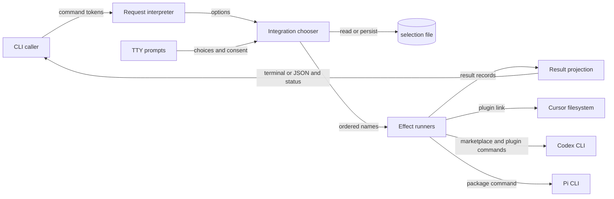

# `csl-agent-kit install` 组件地图

## 1. Scope Summary

- `Scope`：`bin/csl-agent-kit.js`
- `HEAD`：`05a6c689e2344dc925b7dc111f02aa03750114f6`
- `Working tree`：`clean`
- `Generated at`：`2026-07-19T23:14:43+0800`

该文件是 npm 暴露的 `csl-agent-kit` executable，`scripts/install.sh` 也仅把 `install` 与剩余参数转交给它；调用方是终端用户、兼容脚本和非交互自动化（`package.json#bin`，`scripts/install.sh:6`）。它接收 command tokens、TTY/CI、HOME/配置环境和交互选择，解释请求、选定 Cursor/Codex/Pi integrations、执行或预演对应 effects，并把统一 results 投影为终端摘要或 JSON 与退出码（`bin/csl-agent-kit.js#main`）。它不实现三种客户端，也不拥有 repo 中 skills/hooks/package 的业务内容；这些是它链接、注册或交给外部 CLI 的 payload（`bin/csl-agent-kit.js#installCursor`，`bin/csl-agent-kit.js#installCodexPlugin`，`bin/csl-agent-kit.js#installPi`）。

## 2. Domain Glossary

| Term | Meaning here | Not the same as | Evidence |
| --- | --- | --- | --- |
| selection | 交互确认后保存、仅用于下次 checklist 预选的有效 target 名称 | 非交互命令的全局默认配置；`all`/explicit/`yes` 都绕开它 | `bin/csl-agent-kit.js#resolveInstallTargets`，`bin/csl-agent-kit.js#loadInstallSelection`，`bin/csl-agent-kit.js#saveInstallSelection` |
| change | adapter 返回的动作记录，如 `symlink`、`command`、`remove`、`skip`；dry-run 中是计划 | target result；result 还携带 target 级 `ok` 或 `error` | `bin/csl-agent-kit.js#installTargets`，`bin/csl-agent-kit.js#ensureSymlink`，`bin/csl-agent-kit.js#runCommands` |
| `skip` | 实际模式缺少 Codex/Pi executable 时返回的成功 change | adapter failure；它不会把 result 的 `ok` 设为 false | `bin/csl-agent-kit.js#installCodexPlugin`，`bin/csl-agent-kit.js#installPi` |

## 3. Functional Module Map



| Module | What it does | Inputs | Outputs | Owns | Code anchor | Tests |
| --- | --- | --- | --- | --- | --- | --- |
| Request interpreter | 将 argv 解释为安装 options，处理 help/unknown/missing-value 终止 | command 与 args | options、help，或退出 `2` | subcommand gate、flag aliases、位置 target 解析、参数错误 | `bin/csl-agent-kit.js#main`，`bin/csl-agent-kit.js#parseInstallArgs`，`bin/csl-agent-kit.js#splitTargets`，`bin/csl-agent-kit.js#die` | `tests/cli-install-output.test.js:268`，`tests/cli-install-output.test.js:276` |
| Integration chooser | 从 registry 和 options 得到有序 target 集合；在唯一的 interactive 路径管理历史预选与 external consent | options、TTY/CI、selection JSON、prompt response | selected names 或退出 `2` | target registry、`all`/explicit/`yes`/interactive 优先级、selection schema 与授权 gate | `bin/csl-agent-kit.js#targets`，`bin/csl-agent-kit.js#resolveInstallTargets`，`bin/csl-agent-kit.js#buildInstallChoices`，`bin/csl-agent-kit.js#loadInstallSelection`，`bin/csl-agent-kit.js#saveInstallSelection` | `tests/cli-install-output.test.js:232`，`tests/cli-install-output.test.js:250`，`tests/cli-install-output.test.js:288`，`tests/cli-install-output.test.js:306`，`tests/cli-install-output.test.js:450` |
| Effect runners | 依次派发平台 adapter，将真实或 dry-run effects 归一为 changes，并把异常封装为对应 target 的失败 result | selected、options、repo root、用户文件系统、外部 CLI 状态 | 按 selected 顺序的 results | Cursor link、Codex plugin migration/legacy cleanup、Pi install、单 target failure isolation | `bin/csl-agent-kit.js#installTargets`，`bin/csl-agent-kit.js#installCursor`，`bin/csl-agent-kit.js#installCodexPlugin`，`bin/csl-agent-kit.js#installPi`，`bin/csl-agent-kit.js#removeLegacyCodexSkillLinks` | `tests/cli-install-output.test.js:59`，`tests/cli-install-output.test.js:324`，`tests/cli-install-output.test.js:354`，`tests/cli-install-output.test.js:377`，`tests/cli-install-output.test.js:426` |
| Result projection | 在 results 产生后选择机器或人类 formatter；应用 color/verbosity，并复用统一成功谓词退出 | results 与 json/color/verbose/dry-run options | JSON 或 terminal text、exit `0`/`1` | 输出分流、JSON envelope、人类 action 汇总、detail/color policy、aggregate status | `bin/csl-agent-kit.js#main`，`bin/csl-agent-kit.js#printResults`，`bin/csl-agent-kit.js#summarizeChanges`，`bin/csl-agent-kit.js#printChangeDetails`，`bin/csl-agent-kit.js#createColors` | `tests/cli-install-output.test.js:44`，`tests/cli-install-output.test.js:78`，`tests/cli-install-output.test.js:200`，`tests/cli-install-output.test.js:208`，`tests/cli-install-output.test.js:215`，`tests/cli-install-output.test.js:222` |

## 4. Core Working Flows

### 4.1 请求解释与 target 决策

```text
CLI 触发 → command / args → Request interpreter → Integration chooser → selected names
                               └→ 参数无效或 interactive 前置条件不满足时退出 2
```

1. npm bin 或 wrapper 进入 `main`；只有 `install` 解析安装 options，其他 command 打印总帮助（`package.json#bin`，`scripts/install.sh:6`，`bin/csl-agent-kit.js#main`）。
2. Interpreter 接受 `--all`/`all`、`--target(s)`/位置 names、`--yes`、dry-run、JSON、verbose 与 color flags。缺少 target value 或未知 flag 由 `die` 在产生 results 前退出 `2`（`bin/csl-agent-kit.js#parseInstallArgs`，`bin/csl-agent-kit.js#die`）。
3. Chooser 按 `all` → non-empty explicit → `yes` → interactive 短路：`all` 使用 registry 插入顺序；explicit 先验证再按首次出现去重；`yes` 只筛 `default: true`，当前得到 `codex-plugin`（`bin/csl-agent-kit.js#resolveInstallTargets`，`bin/csl-agent-kit.js#validateTargets`）。
4. 前三种策略均不加载 history 或 prompts。只有 interactive 要求 TTY 且非 CI，再加载 `prompts`（`bin/csl-agent-kit.js#resolveInstallTargets`）。

### 4.2 交互选择、拒绝与偏好保存

```text
interactive → saved selection → checklist → external consent → 原子替换 selection → selected names
                  └→ 无效 history 回退 default；取消/拒绝在任何保存或 effect 前退出 2
```

1. selection 路径由 `CSL_AGENT_KIT_HOME` 或 `~/.csl-agent-kit` 决定。读取仅接受 version 1 数组，再按 registry 过滤；失败或过滤为空时返回 null，由 choices 使用 default（`bin/csl-agent-kit.js#installSelectionFile`，`bin/csl-agent-kit.js#loadInstallSelection`，`bin/csl-agent-kit.js#buildInstallChoices`；直接测试：`tests/cli-install-output.test.js:250`，`tests/cli-install-output.test.js:288`）。
2. 选中 Codex/Pi 中任一 `external: true` target 才显示第二次确认；Cursor-only 选择不显示。取消 checklist 或拒绝 external consent 会直接退出 `2`，不保存、不执行（`bin/csl-agent-kit.js#targets`，`bin/csl-agent-kit.js#resolveInstallTargets`）。
3. 确认选择经 registry 过滤后，以 mode `0600` 写同目录临时文件再 rename。保存失败只 warning，本次 selected 仍继续；dry-run 不阻止这项偏好写入（`bin/csl-agent-kit.js#saveInstallSelection`，`bin/csl-agent-kit.js#resolveInstallTargets`；直接测试：`tests/cli-install-output.test.js:232`，`tests/cli-install-output.test.js:450`）。

### 4.3 平台 effects 与 Codex cleanup gate

```text
selected → Effect runners → symlink / command / remove effects 或 plans → per-target results
                                 └→ adapter 异常局部失败；Codex required add 失败时 cleanup 未开始
```

1. `installTargets` 按 selected 遍历 `spec.run`；异常只形成当前 target 的 `{ok: false, error}`，后续 target 继续（`bin/csl-agent-kit.js#installTargets`）。
2. Cursor 的 dry-run 在任何 mkdir/unlink/symlink 前返回 plan；实际执行保留正确 link、替换错误 link、拒绝覆盖普通文件（`bin/csl-agent-kit.js#ensureSymlink`）。Pi/Codex 的 dry-run 在 `spawnSync` 前返回 command plans；实际缺少 executable 时返回 successful `skip`（`bin/csl-agent-kit.js#installPi`，`bin/csl-agent-kit.js#installCodexPlugin`，`bin/csl-agent-kit.js#runCommands`）。
3. Codex 先运行六条 allow-failure removals，再运行两个 required adds；required command 非零时抛错。只有整个序列返回后才调用 legacy cleanup，所以 add failure 保留 owned links（`bin/csl-agent-kit.js#installCodexPlugin`，`bin/csl-agent-kit.js#runCommands`；直接测试：`tests/cli-install-output.test.js:426`）。
4. cleanup 不遍历 symlinked legacy root，只检查 symlink children；文本 source 或 resolved source 位于真实 repo `skills/` 内即 owned。dry-run 只报告 remove，actual unlink；成功重跑不再产生 remove（`bin/csl-agent-kit.js#removeLegacyCodexSkillLinks`，`bin/csl-agent-kit.js#isWithin`；直接测试：`tests/cli-install-output.test.js:324`，`tests/cli-install-output.test.js:354`，`tests/cli-install-output.test.js:377`）。

### 4.4 统一 results 的输出分流

```text
results → options.json ? JSON.stringify : printResults → stdout → every(ok) 决定 exit 0/1
                                        └→ human path 才应用 color 与 verbose details
```

1. 所有 effects 完成后，`main` 才以 `options.json` 精确分流：true 时输出 `{ok, results}`；false 时调用 `printResults`（`bin/csl-agent-kit.js#main`）。
2. Human formatter 建立 colors、根据 dry-run 选择 phase、汇总 changes；`verbose` 才调用 detail renderer。`colorMode` 和 `NO_COLOR` 只在 `createColors` 影响 ANSI（`bin/csl-agent-kit.js#printResults`，`bin/csl-agent-kit.js#summarizeChanges`，`bin/csl-agent-kit.js#printChangeDetails`，`bin/csl-agent-kit.js#createColors`）。
3. JSON 不经过 human formatter，因此 color/verbose 不改变其内容；两条输出路径结束后都用相同的 `results.every(item.ok)` 退出（`bin/csl-agent-kit.js#main`；直接测试：`tests/cli-install-output.test.js:222`）。

## 5. Cross-flow Invariants

- **Registry 是 selection 与 dispatch 的共同策略源**：`targets` 同时驱动 validation、all/default、choices、help 和 `spec.run`；违反会造成可见、可选、可执行 targets 不一致（`bin/csl-agent-kit.js#targets`，`bin/csl-agent-kit.js#validateTargets`，`bin/csl-agent-kit.js#buildInstallChoices`，`bin/csl-agent-kit.js#printInstallHelp`，`bin/csl-agent-kit.js#installTargets`）。
- **dry-run 隔离平台状态而非交互偏好**：所有 runner 在真实平台写入前返回 plans，但 confirmed interactive selection 仍会保存；违反或误解会让 preview 修改安装状态，或错误假设它绝对零写入（`bin/csl-agent-kit.js#ensureSymlink`，`bin/csl-agent-kit.js#runCommands`，`bin/csl-agent-kit.js#removeLegacyCodexSkillLinks`，`bin/csl-agent-kit.js#saveInstallSelection`）。
- **results 是输出模式与退出状态的单一输入**：JSON/human 分流只发生在 `installTargets` 返回后，且退出谓词与 JSON 顶层 `ok` 使用同一 `every(ok)`；违反会让格式选择改变安装语义（`bin/csl-agent-kit.js#installTargets`，`bin/csl-agent-kit.js#main`）。
