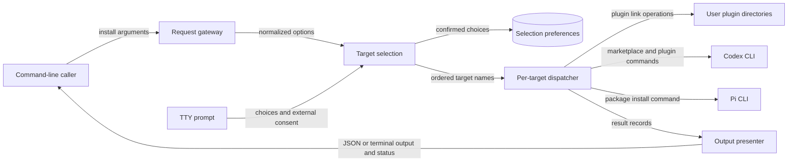

# `bin/csl-agent-kit.js` 组件地图

## Scope Summary

- **Scope**：`bin/csl-agent-kit.js`
- **HEAD**：`05a6c689e2344dc925b7dc111f02aa03750114f6`
- **Working tree**：`clean`
- **Generated at**：`2026-07-19T23:36:38+0800`

该文件是 npm 包暴露的 `csl-agent-kit` 命令入口，为命令行调用者选择并安装 Cursor 本地插件、Codex plugin 或 Pi package。它接收 `install` 子命令、目标选择与呈现选项，解析出有序目标集合，调用对应文件系统或外部 CLI effect，并交付逐目标结果、终端摘要或 JSON 以及进程退出状态；交互路径还负责记住已确认的选择。它不定义被安装的 skills、hooks 或插件内容，也不实现 Codex、Cursor、Pi 自身的安装机制；这些内容与外部系统分别由 package/manifest 和相应客户端负责（`package.json#bin`、`bin/csl-agent-kit.js#main`、`bin/csl-agent-kit.js#targets`、`.codex-plugin/plugin.json#skills`）。

## Domain Glossary

| Term | Meaning here | Not the same as | Evidence |
| --- | --- | --- | --- |
| target | 注册在 `targets` 中、可被一次 install 请求选择的安装职责；当前为 `cursor`、`codex-plugin`、`pi` | npm package 的文件发布 target | `bin/csl-agent-kit.js#targets`、`bin/csl-agent-kit.js#validateTargets` |
| change | target handler 返回的可扁平化结果记录，描述 `symlink`、`unchanged`、`command`、`remove` 或 `skip` | 已保证实际发生的副作用；dry-run 记录只表示计划 | `bin/csl-agent-kit.js#ensureSymlink`、`bin/csl-agent-kit.js#runCommands`、`bin/csl-agent-kit.js#summarizeChanges` |
| successful skip | 外部 CLI 不存在时返回 `skip` change，但该 target 仍产生 `ok: true` | dispatcher 捕获异常形成的失败 target | `bin/csl-agent-kit.js#installCodexPlugin`、`bin/csl-agent-kit.js#installPi`、`bin/csl-agent-kit.js#installTargets` |

## Functional Module Map



| Module | What it does | Inputs | Outputs | Owns | Code anchor | Tests |
| --- | --- | --- | --- | --- | --- | --- |
| Request gateway | 区分 `install` 与 help，解析 install flags、位置目标和逗号列表；解析错误立即以状态 2 终止 | `process.argv` | 规范化 `options`，或 help/error 输出 | install 参数语法与解析期失败 | `bin/csl-agent-kit.js#main`、`bin/csl-agent-kit.js#parseInstallArgs`、`bin/csl-agent-kit.js#splitTargets`、`bin/csl-agent-kit.js#die` | `tests/cli-install-output.test.js:200`、`tests/cli-install-output.test.js:268`、`tests/cli-install-output.test.js:276` |
| Target selection & consent | 按 `--all`、显式 targets、`--yes`、交互顺序解析目标；交互时读取上次选择、要求外部命令授权，并以原子替换记忆已确认选择 | 规范化 options、TTY/CI 状态、selection file、prompt 答案 | 去重且保持顺序的 target names；交互偏好文件 | 默认目标、目标合法性、external consent、selection schema v1 | `bin/csl-agent-kit.js#resolveInstallTargets`、`bin/csl-agent-kit.js#buildInstallChoices`、`bin/csl-agent-kit.js#loadInstallSelection`、`bin/csl-agent-kit.js#saveInstallSelection` | `tests/cli-install-output.test.js:232`、`tests/cli-install-output.test.js:250`、`tests/cli-install-output.test.js:288`、`tests/cli-install-output.test.js:306`、`tests/cli-install-output.test.js:450` |
| Per-target dispatcher & effects | 按选择顺序调用 registry handler，把每项返回值或异常隔离成统一 result；handler 负责 Cursor symlink、Codex marketplace/plugin 迁移与旧链接清理、Pi install，并在 dry-run 中返回计划 | target names、options、repo/package paths、用户目录、外部 CLI | `{target, ok, changes}` 或 `{target, ok:false, error}` 的有序列表 | target registry、逐项失败隔离、安装副作用与 dry-run 语义 | `bin/csl-agent-kit.js#targets`、`bin/csl-agent-kit.js#installTargets`、`bin/csl-agent-kit.js#installCursor`、`bin/csl-agent-kit.js#installCodexPlugin`、`bin/csl-agent-kit.js#installPi`、`bin/csl-agent-kit.js#runCommands` | `tests/cli-install-output.test.js:59`、`tests/cli-install-output.test.js:324`、`tests/cli-install-output.test.js:354`、`tests/cli-install-output.test.js:377`、`tests/cli-install-output.test.js:426` |
| Result presenter | 从同一 result 列表精确分流到 JSON 或人类摘要；人类路径应用 color 与 verbose detail，最终用同一成功谓词决定退出码 | results、`json`、`colorMode`、`verbose`、`dryRun` | stdout 与状态 0/1 | 结果格式、ANSI 策略、detail 展开、安装完成状态 | `bin/csl-agent-kit.js#main`、`bin/csl-agent-kit.js#printResults`、`bin/csl-agent-kit.js#createColors`、`bin/csl-agent-kit.js#printChangeDetails` | `tests/cli-install-output.test.js:44`、`tests/cli-install-output.test.js:78`、`tests/cli-install-output.test.js:200`、`tests/cli-install-output.test.js:208`、`tests/cli-install-output.test.js:215`、`tests/cli-install-output.test.js:222` |

## Core Working Flows

### 1. 非交互 install 从参数到可观察结果

```text
install 调用 → argv/options → Request gateway → Target selection → Per-target dispatcher & effects → Result presenter → stdout + exit
                                                                                     └→ 解析失败 exit 2；任一 target 失败时最终 exit 1
```

1. `main` 只在首个 token 为 `install` 时进入安装链；`parseInstallArgs` 累积 targets，并把 `--all`、`--yes`、`--dry-run`、`--json`、`--verbose` 与 color mode 规范化。未知 option、缺失 target 值或未知 target 经 `die` 直接输出错误并退出 2（`bin/csl-agent-kit.js#main`、`bin/csl-agent-kit.js#parseInstallArgs`、`bin/csl-agent-kit.js#validateTargets`、`bin/csl-agent-kit.js#die`）。
2. `resolveInstallTargets` 按优先级选择：`--all` 返回 registry 全集；显式列表先校验再用 `Set` 去重并保持首次出现顺序；`--yes` 只返回 `targets` 中 `default: true` 的 `codex-plugin`。这些非交互分支不会读取或保存 selection file（`bin/csl-agent-kit.js#resolveInstallTargets`、`bin/csl-agent-kit.js#targets`；`tests/cli-install-output.test.js:450`）。
3. `installTargets` 依序调用 `targets[name].run(options)`；单个 handler 抛错只生成该项 `{ok:false,error}`，循环继续，因此 result 顺序与选择顺序一致（`bin/csl-agent-kit.js#installTargets`）。Cursor 交给 `ensureSymlink`，Codex 与 Pi 分别进入其 CLI handler（`bin/csl-agent-kit.js#installCursor`、`bin/csl-agent-kit.js#installCodexPlugin`、`bin/csl-agent-kit.js#installPi`）。
4. 所有 handler 完成后才呈现结果。`options.json` 为真时，`main` 直接序列化 `{ok: results.every(...), results}`；否则 `printResults` 生成摘要，并只在 `verbose` 时展开 changes。随后 `main` 再用相同的 `results.every(item => item.ok)` 选择状态 0 或 1（`bin/csl-agent-kit.js#main`、`bin/csl-agent-kit.js#printResults`、`bin/csl-agent-kit.js#printChangeDetails`；`tests/cli-install-output.test.js:44`、`tests/cli-install-output.test.js:222`）。

### 2. 交互选择、授权与偏好持久化

```text
无选择参数 → TTY/CI 检查 → saved selection + prompt → external consent → selection file → 正常 install 链
                      └→ 非 TTY、取消或拒绝授权：错误 + exit 2，零派发
```

1. 仅当 `--all`、显式 targets 和 `--yes` 均未命中时，`resolveInstallTargets` 要求 stdin 是 TTY 且不在 CI；否则以使用显式选择的提示退出 2（`bin/csl-agent-kit.js#resolveInstallTargets`）。
2. 组件按需加载 `prompts`，以 `loadInstallSelection` 的有效 v1 数据作为预选；文件缺失、JSON 无效、版本/shape 不符或没有仍在 registry 中的 target 都回退到 registry 默认项（`bin/csl-agent-kit.js#loadInstallSelection`、`bin/csl-agent-kit.js#buildInstallChoices`；`tests/cli-install-output.test.js:232`、`tests/cli-install-output.test.js:250`）。
3. multiselect 至少选一项；选择含 `external: true` 的 Codex/Pi 时才显示确认。取消或未确认经 `die` 结束，尚未调用 dispatcher（`bin/csl-agent-kit.js#resolveInstallTargets`、`bin/csl-agent-kit.js#targets`）。
4. 确认后 `saveInstallSelection` 过滤 registry 顺序中的有效项，创建数据目录，将 mode 0600 的临时文件 rename 为 `install-selection.json`，并在 `finally` 清理临时文件。记忆失败只写 warning，不阻断当前选择继续安装（`bin/csl-agent-kit.js#saveInstallSelection`、`bin/csl-agent-kit.js#installSelectionFile`、`bin/csl-agent-kit.js#resolveInstallTargets`）。

### 3. Codex plugin 迁移与旧链接清理

```text
codex-plugin target → CLI 可用性/dry-run → ordered Codex commands → owned legacy-link cleanup → change records
                                            └→ 必须成功的 add 命令失败：target 失败，cleanup 不执行
```

1. 非 dry-run 先用 `hasCommand("codex")` 探测 CLI；缺失时返回 `skip` change，不抛错，因此 dispatcher 将该 target 标为成功。dry-run 跳过可用性探测，保留完整计划（`bin/csl-agent-kit.js#installCodexPlugin`、`bin/csl-agent-kit.js#hasCommand`）。
2. `runCommands` 依序生成六个旧 identity/marketplace remove、一个本仓库 marketplace add、一个标准 plugin add。remove 命令允许失败；两个 add 不允许失败。dry-run 只产生 command records，不调用子进程（`bin/csl-agent-kit.js#installCodexPlugin`、`bin/csl-agent-kit.js#runCommands`；`tests/cli-install-output.test.js:59`）。
3. 只有整组命令返回后才调用 `removeLegacyCodexSkillLinks`。它拒绝遍历 symlink 或非目录的 `~/.agents/skills`，只处理其中 symlink，并通过词法路径或最终解析路径确认来源位于本仓库 `skills` 根内；dry-run 报告 remove，实际模式 unlink。其他目录、普通文件、外部及断裂的非本仓库链接保持不变（`bin/csl-agent-kit.js#removeLegacyCodexSkillLinks`、`bin/csl-agent-kit.js#isWithin`；`tests/cli-install-output.test.js:324`、`tests/cli-install-output.test.js:354`、`tests/cli-install-output.test.js:377`）。
4. 必须成功的 plugin add 抛错时，`installCodexPlugin` 在 cleanup 前退出；dispatcher 记录 Codex 失败，已有旧链接不被清理，最终整体状态为 1（`bin/csl-agent-kit.js#runCommands`、`bin/csl-agent-kit.js#installTargets`、`bin/csl-agent-kit.js#main`；`tests/cli-install-output.test.js:426`）。

## Cross-flow Invariants

| Rule | Enforced at | Consequence when violated | Evidence |
| --- | --- | --- | --- |
| 只有 registry 中的 target 能进入派发，且显式重复项按首次出现顺序去重 | `resolveInstallTargets`、`validateTargets` | 未知 target 在任何 effect 前退出 2；合法 target 不会被重复执行 | `bin/csl-agent-kit.js#resolveInstallTargets`、`bin/csl-agent-kit.js#validateTargets` |
| target 失败是结果数据，不会由 dispatcher 重新抛出；最终成功要求每项 `ok` | `installTargets`、`main` | 单项异常仍允许后续项参与；任一失败使 JSON 顶层 `ok:false` 且进程退出 1 | `bin/csl-agent-kit.js#installTargets`、`bin/csl-agent-kit.js#main` |
| dry-run 由 effect primitive 负责只产出计划记录 | `ensureSymlink`、`runCommands`、`removeLegacyCodexSkillLinks` | 不创建/替换 Cursor link、不启动安装命令、不删除旧 Codex links | `bin/csl-agent-kit.js#ensureSymlink`、`bin/csl-agent-kit.js#runCommands`、`bin/csl-agent-kit.js#removeLegacyCodexSkillLinks`、`tests/cli-install-output.test.js:324` |
| JSON 与人类输出共享同一 result 列表和退出谓词，但呈现控制互不泄漏 | `main`、`printResults`、`createColors` | `--color` 不污染 JSON；`verbose` 只展开人类 change details；两种格式对整体成功的判断相同 | `bin/csl-agent-kit.js#main`、`bin/csl-agent-kit.js#printResults`、`bin/csl-agent-kit.js#createColors`、`tests/cli-install-output.test.js:222` |
