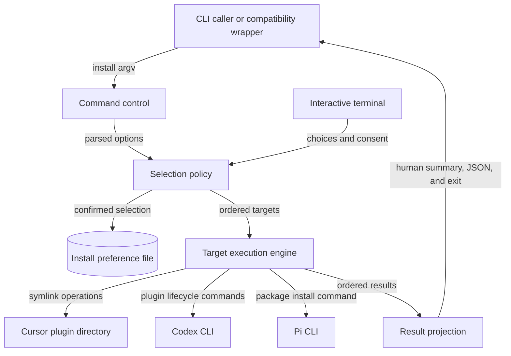

# `bin/csl-agent-kit.js` 当前组件地图

## Scope Summary

- **Scope**：`bin/csl-agent-kit.js`
- **HEAD**：`05a6c689e2344dc925b7dc111f02aa03750114f6`
- **Working tree**：`clean`
- **Generated at**：`2026-07-19T23:56:41+0800`

该组件是 `@ssbun/csl-agent-kit` 包发布的命令行入口，也由兼容脚本转交 `install` 调用。它面向 CLI 使用者，接收子命令、target selectors、dry-run 与输出选项，解析并授权一个有序安装目标集合，执行 Cursor link、Codex plugin lifecycle 或 Pi package effect，再返回逐目标结果、JSON/人类输出及进程状态；交互安装时还维护上次确认的选择。它不拥有被安装的 skills、hooks、Pi extensions 或各外部客户端的内部行为，只消费仓库根和 manifest 所描述的发布内容（`package.json#bin`、`package.json#pi`、`scripts/install.sh`、`bin/csl-agent-kit.js#main`、`.codex-plugin/plugin.json#skills`）。

## Domain Glossary

| Term | Meaning here | Not the same as | Evidence |
| --- | --- | --- | --- |
| integration target | `targets` 中带稳定名称、默认/外部 policy 与 handler 的一项安装职责 | 文件路径或 npm build target | `bin/csl-agent-kit.js#targets` |
| change | handler 返回、供输出层汇总或展开的 effect 描述；可为计划、完成、未变化、删除或跳过 | 等同于成功；失败由 result 的 `ok:false` 表示 | `bin/csl-agent-kit.js#installTargets`、`bin/csl-agent-kit.js#summarizeChanges` |
| owned legacy link | `~/.agents/skills` 中词法来源或最终解析来源位于本仓库 `skills` 根内的 symlink | 该目录中的任意文件或外部 symlink | `bin/csl-agent-kit.js#removeLegacyCodexSkillLinks`、`bin/csl-agent-kit.js#isWithin` |

## Functional Module Map



| Module | What it does | Inputs | Outputs | Owns | Code anchor | Tests |
| --- | --- | --- | --- | --- | --- | --- |
| Command control | 识别 `install`/help，建立固定 options shape，解析 selectors 与呈现 flags，并在参数错误时提前终止 | `process.argv` | install options，或 help/error | CLI grammar、解析期 exit 0/2 | `bin/csl-agent-kit.js#main`、`bin/csl-agent-kit.js#parseInstallArgs`、`bin/csl-agent-kit.js#splitTargets`、`bin/csl-agent-kit.js#die` | `tests/cli-install-output.test.js:200`、`tests/cli-install-output.test.js:268`、`tests/cli-install-output.test.js:276` |
| Selection policy | 依优先级解析 all、显式、默认或交互 targets；交互时加载预选、控制 external consent 并原子保存确认结果 | options、TTY/CI、prompt 答案、selection file | 保序去重的 target names；交互偏好 | registry 默认性、合法性、授权 gate、selection schema | `bin/csl-agent-kit.js#targets`、`bin/csl-agent-kit.js#resolveInstallTargets`、`bin/csl-agent-kit.js#loadInstallSelection`、`bin/csl-agent-kit.js#saveInstallSelection` | `tests/cli-install-output.test.js:232`、`:250`、`:288`、`:306`、`:450` |
| Target execution engine | 按 registry 顺序/用户顺序调用真实 handler，把每项 changes 或异常变成统一 result；实现 Cursor、Codex、Pi effects 与 dry-run | selected names、options、repo root、HOME/PATH | ordered `{target,ok,changes|error}` | target strategy、逐项失败隔离、文件系统与子进程 effect | `bin/csl-agent-kit.js#installTargets`、`bin/csl-agent-kit.js#installCursor`、`bin/csl-agent-kit.js#installCodexPlugin`、`bin/csl-agent-kit.js#installPi`、`bin/csl-agent-kit.js#runCommands` | `tests/cli-install-output.test.js:59`、`:324`、`:354`、`:377`、`:426` |
| Result projection | 从统一 results 精确选择 JSON 或终端 renderer；终端路径控制 ANSI、summary 与 verbose details，最后计算整体退出 | results 与 output options | stdout、exit 0/1 | 机器/人类格式边界、颜色、详细度、整体成功谓词 | `bin/csl-agent-kit.js#main`、`bin/csl-agent-kit.js#printResults`、`bin/csl-agent-kit.js#createColors`、`bin/csl-agent-kit.js#printChangeDetails` | `tests/cli-install-output.test.js:44`、`:78`、`:200`、`:208`、`:215`、`:222` |

## Core Working Flows

### 1. 显式或默认安装

```text
install → argv → Command control → Selection policy → Target execution engine → Result projection → stdout + exit
                  └→ 参数/help 提前退出       └→ 每项异常变成失败 result，后续项继续
```

1. `main` 取首 token；`install` 进入 `parseInstallArgs`，其他 command 输出顶层 help。install 内的 `--help` 在 parser 中输出详细 help 并退出 0；未知 option、缺失 `--target` 值经 `die` 写 stderr 并退出 2，因此 selection 与 effect 均不可达（`bin/csl-agent-kit.js#main`、`bin/csl-agent-kit.js#parseInstallArgs`、`bin/csl-agent-kit.js#printInstallHelp`、`bin/csl-agent-kit.js#die`）。
2. `resolveInstallTargets` 依 `--all`、显式 targets、`--yes`、交互的优先级返回。all 使用 `Object.keys(targets)` 的声明顺序；显式 targets 先验证再用 `Set` 保留首次出现；yes 只选 `default:true` 的 `codex-plugin`。前三路不触碰保存选择（`bin/csl-agent-kit.js#resolveInstallTargets`、`bin/csl-agent-kit.js#validateTargets`、`bin/csl-agent-kit.js#targets`；`tests/cli-install-output.test.js:450`）。
3. `installTargets` 对 selected 逐项查 registry 并调用 `spec.run`。成功保存 handler changes；异常仅保存当前 target 的 error，catch 位于循环内，故后续 target 仍执行且 results 保持选择顺序（`bin/csl-agent-kit.js#installTargets`）。
4. engine 完成后，`options.json` 令 `main` 直接序列化 `{ok,results}`；否则 `printResults` 输出标题、每项摘要和 completion，只有 `verbose` 才展开 changes。JSON 顶层 `ok` 与最终退出均使用 `results.every(item => item.ok)`；任一失败最终退出 1，否则退出 0（`bin/csl-agent-kit.js#main`、`bin/csl-agent-kit.js#printResults`、`bin/csl-agent-kit.js#printChangeDetails`；`tests/cli-install-output.test.js:222`）。

### 2. 交互式选择、授权与记忆

```text
无 selector → TTY/CI admission → saved choices → checklist → external consent → atomic save → 安装主流程
                   └→ 不满足：exit 2             └→ 取消/拒绝：exit 2，零保存、零 effect
```

1. 只有前三种 selector 均未命中才进入交互。stdin 非 TTY 或设置 CI 时，`die` 要求显式 `--target`/`--all`/`--yes`，并在加载 state 前退出（`bin/csl-agent-kit.js#resolveInstallTargets`）。
2. 通过环境 admission 后按需加载 `prompts`，再由 `loadInstallSelection` 读取 v1 `selectedTargets`。无文件、非法 JSON/schema 或过滤后无当前 target 都返回 null；`buildInstallChoices` 随后回退 registry 默认（`bin/csl-agent-kit.js#loadInstallSelection`、`bin/csl-agent-kit.js#buildInstallChoices`；`tests/cli-install-output.test.js:232`、`:250`、`:288`、`:306`）。
3. checklist 至少选一项。所选 target 含 `external:true` 时才出现 confirm；取消或拒绝通过 `die` 在 save 与 dispatcher 前退出 2（`bin/csl-agent-kit.js#resolveInstallTargets`、`bin/csl-agent-kit.js#targets`）。
4. 确认后，`saveInstallSelection` 以 registry 顺序过滤有效项，写 mode 0600 的同目录临时文件并 rename，finally 清理临时文件。保存异常仅打印 warning，当前 selection 仍返回并进入安装（`bin/csl-agent-kit.js#saveInstallSelection`、`bin/csl-agent-kit.js#installSelectionFile`、`bin/csl-agent-kit.js#resolveInstallTargets`）。

### 3. 三类 target effects 与 Codex 迁移边界

```text
ordered target → registry handler → dry-run plan 或真实 effect → change records → dispatcher result
                                      └→ handler 抛错：当前失败；其余 target 继续
```

1. Cursor handler 以仓库真实路径为 source 调用 `ensureSymlink`。dry-run 直接返回计划；真实模式创建 parent，拒绝覆盖普通文件，复用已指向同一 source 的 link，否则替换旧 symlink（`bin/csl-agent-kit.js#installCursor`、`bin/csl-agent-kit.js#ensureSymlink`）。
2. Codex 与 Pi 在非 dry-run 中先 `hasCommand`；CLI 缺失返回 `skip` change 而不抛错，因此该 target 仍是 `ok:true`。Pi 的真实 effect 是单条 `pi install <repoRoot>`（`bin/csl-agent-kit.js#installCodexPlugin`、`bin/csl-agent-kit.js#installPi`、`bin/csl-agent-kit.js#hasCommand`）。
3. Codex handler 先通过 `runCommands` 依序计划/执行六个允许失败的旧 identity/marketplace remove、一个必须成功的 marketplace add 和一个必须成功的 plugin add。dry-run 不 spawn；真实模式若 required add 失败则抛错并跳过后续 legacy cleanup（`bin/csl-agent-kit.js#installCodexPlugin`、`bin/csl-agent-kit.js#runCommands`；`tests/cli-install-output.test.js:59`、`:426`）。
4. 命令阶段全部返回后，`removeLegacyCodexSkillLinks` 才检查 `~/.agents/skills`。目录为 symlink/非目录时不遍历；子项仅在自身是 symlink 且词法或解析来源位于仓库 `skills` 根内时形成 remove。dry-run 只报告，真实模式 unlink；普通目录、文件与外部 link 保留（`bin/csl-agent-kit.js#removeLegacyCodexSkillLinks`、`bin/csl-agent-kit.js#isWithin`；`tests/cli-install-output.test.js:324`、`:354`、`:377`）。

## Cross-flow Invariants

| Rule | Enforced at | Consequence when violated | Evidence |
| --- | --- | --- | --- |
| registry 是目标标识、声明顺序、默认性、external policy、handler 与 help 文案的共同事实源 | `targets`、`resolveInstallTargets`、`printInstallHelp`、`installTargets` | 未注册名称在 effect 前 exit 2；all/help/交互 choices 与派发不会各自维护另一份顺序 | `bin/csl-agent-kit.js#targets`、`bin/csl-agent-kit.js#validateTargets`、`bin/csl-agent-kit.js#printInstallHelp` |
| dry-run 必须在 effect primitive 内返回描述而不改变目标状态 | `ensureSymlink`、`runCommands`、`removeLegacyCodexSkillLinks` | 不建/换 link、不 spawn install command、不删旧 link，但保留可呈现的计划 | `bin/csl-agent-kit.js#ensureSymlink`、`bin/csl-agent-kit.js#runCommands`、`bin/csl-agent-kit.js#removeLegacyCodexSkillLinks`、`tests/cli-install-output.test.js:324` |
| 每个已选择 target 恰好产生一个同序 result；成功由 handler 是否抛错决定 | `installTargets` | `skip` 是成功 change；一个异常不吞掉后续 result，但使总体 `ok:false`/exit 1 | `bin/csl-agent-kit.js#installTargets`、`bin/csl-agent-kit.js#main` |
| 机器与人类路径消费同一 results，呈现 flags 不改变安装语义 | `main`、`printResults`、`createColors` | color/verbose 只影响终端绘制；JSON 保持可解析、无 ANSI，退出判断一致 | `bin/csl-agent-kit.js#main`、`bin/csl-agent-kit.js#printResults`、`bin/csl-agent-kit.js#createColors`、`tests/cli-install-output.test.js:222` |
