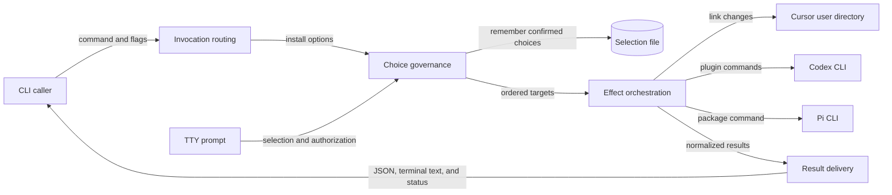

# `bin/csl-agent-kit.js` 开发地图

## Scope Summary

- **Scope**：`bin/csl-agent-kit.js`
- **HEAD**：`05a6c689e2344dc925b7dc111f02aa03750114f6`
- **Working tree**：`clean`
- **Generated at**：`2026-07-20T00:19:11+0800`

本文件是 npm 包发布的 `csl-agent-kit` 可执行入口，并承接兼容 shell wrapper 的 `install` 参数。它为 CLI 调用者解析安装与呈现选项，依据 registry/default/交互授权得到有序 integrations，对 Cursor 用户目录、Codex plugin lifecycle 或 Pi package 执行 effect，最终交付逐目标结果、JSON 或终端摘要及退出状态；交互路径还原子记忆已确认选择。它不定义被安装的 skills、hooks 或 Pi extensions，也不实现 Codex、Cursor、Pi 客户端内部逻辑（`package.json#bin`、`scripts/install.sh`、`bin/csl-agent-kit.js#main`、`.codex-plugin/plugin.json#skills`、`package.json#pi`）。

## Domain Glossary

| Term | Meaning here | Not the same as | Evidence |
| --- | --- | --- | --- |
| target | `targets` registry 内具名安装职责；metadata 同时控制默认选择、交互授权与 handler | 命令行输出路径或 npm 发布目录 | `bin/csl-agent-kit.js#targets` |
| result | dispatcher 为一个已选择 target 产生的 `{target,ok,changes}` 或 `{target,ok:false,error}` | 单个 filesystem/command change | `bin/csl-agent-kit.js#installTargets` |
| skip | 外部 CLI 不可用时 handler 正常返回的 change，target 仍为成功 | handler 抛错形成的 failed result | `bin/csl-agent-kit.js#installCodexPlugin`、`bin/csl-agent-kit.js#installPi`、`bin/csl-agent-kit.js#installTargets` |

## Functional Module Map



| Module | What it does | Inputs | Outputs | Owns | Code anchor | Tests |
| --- | --- | --- | --- | --- | --- | --- |
| Invocation routing | 区分 install/help，扫描参数并建立固定 options；参数错误或 install help 在 effect 前直接退出 | argv | options、help 或 error | command/flag grammar、解析期 exit 0/2 | `bin/csl-agent-kit.js#main`、`bin/csl-agent-kit.js#parseInstallArgs`、`bin/csl-agent-kit.js#splitTargets`、`bin/csl-agent-kit.js#die` | `tests/cli-install-output.test.js:200`、`:268`、`:276` |
| Choice governance | 按 all、explicit、yes、interactive 优先级选 target；验证名称，加载交互预选，控制 external consent，并保存确认结果 | options、TTY/CI、saved state、prompt response | 保序去重的 target names、selection file | registry policy、授权 gate、selection schema v1 | `bin/csl-agent-kit.js#targets`、`bin/csl-agent-kit.js#resolveInstallTargets`、`bin/csl-agent-kit.js#loadInstallSelection`、`bin/csl-agent-kit.js#saveInstallSelection` | `tests/cli-install-output.test.js:232`、`:250`、`:288`、`:306`、`:450` |
| Effect orchestration | 逐 target 调用 registry handler，把 changes 或异常隔离为同序 results；实现 Cursor symlink、Codex migration/cleanup、Pi install 与 dry-run | targets、options、repo root、HOME/PATH | ordered results | target strategy、effect 与逐项失败边界 | `bin/csl-agent-kit.js#installTargets`、`bin/csl-agent-kit.js#installCursor`、`bin/csl-agent-kit.js#installCodexPlugin`、`bin/csl-agent-kit.js#installPi`、`bin/csl-agent-kit.js#runCommands` | `tests/cli-install-output.test.js:59`、`:324`、`:354`、`:377`、`:426` |
| Result delivery | 由同一 results 精确分流 JSON/人类格式；人类路径生成 summary、颜色和 verbose details，随后计算 exit | results、json/color/verbose/dryRun | stdout、exit 0/1 | formatter、presentation policy、整体成功谓词 | `bin/csl-agent-kit.js#main`、`bin/csl-agent-kit.js#printResults`、`bin/csl-agent-kit.js#createColors`、`bin/csl-agent-kit.js#printChangeDetails` | `tests/cli-install-output.test.js:44`、`:78`、`:200`、`:208`、`:215`、`:222` |

## Core Working Flows

### 1. 从 install invocation 到 completion

```text
CLI 调用 → argv → Invocation routing → Choice governance → Effect orchestration → Result delivery → stdout + exit
                   └→ help/error 直接退出       └→ 单项失败 result；其余项继续
```

1. `main` 仅对首 token `install` 进入安装路径；`parseInstallArgs` 将 selectors、dry-run、JSON、verbose 与 color mode 归一。install help 输出详细帮助并退出 0；未知 option 或缺 target 值由 `die` 写 stderr 并退出 2（`bin/csl-agent-kit.js#main`、`bin/csl-agent-kit.js#parseInstallArgs`、`bin/csl-agent-kit.js#printInstallHelp`、`bin/csl-agent-kit.js#die`）。
2. `resolveInstallTargets` 依序处理 `--all`、显式 targets、`--yes`、interactive。all 使用 registry 声明顺序；显式列表先验证后用 `Set` 保留首次出现；yes 只选 `default:true` 的 `codex-plugin`。这些非交互分支不读写 selection file（`bin/csl-agent-kit.js#resolveInstallTargets`、`bin/csl-agent-kit.js#validateTargets`、`bin/csl-agent-kit.js#targets`；`tests/cli-install-output.test.js:450`）。
3. `installTargets` 循环内对每个 `spec.run(options)` 使用独立 try/catch，故每个选择恰好形成一个同序 result；一个异常变为当前失败，不阻止后续 handler（`bin/csl-agent-kit.js#installTargets`）。
4. results 完成后，`options.json` 使 `main` 直接序列化 `{ok,results}`，否则 `printResults` 输出每项摘要与 completion，并仅在 verbose 时展开 changes。JSON 顶层 ok 与进程状态均用 `results.every(item => item.ok)`，任一失败 exit 1，否则 exit 0（`bin/csl-agent-kit.js#main`、`bin/csl-agent-kit.js#printResults`、`bin/csl-agent-kit.js#printChangeDetails`；`tests/cli-install-output.test.js:222`）。

### 2. 交互选择与持久状态

```text
无 selector → TTY/CI admission → load saved selection → checklist → external consent → atomic save → 主安装流
                   └→ exit 2                         └→ 取消/拒绝：exit 2，零保存、零派发
```

1. 只有非交互 selectors 均未命中才进入交互；stdin 非 TTY 或 `CI` 存在时在加载 state 前 `die`（`bin/csl-agent-kit.js#resolveInstallTargets`）。
2. 通过 admission 后按需加载 `prompts`。`loadInstallSelection` 接受 version 1 数组，并按当前 registry 过滤；文件缺失、非法或过滤后为空时返回 null，`buildInstallChoices` 回退 registry default（`bin/csl-agent-kit.js#loadInstallSelection`、`bin/csl-agent-kit.js#buildInstallChoices`；`tests/cli-install-output.test.js:232`、`:250`、`:288`、`:306`）。
3. checklist 至少选择一项；选择含 `external:true` 的 Codex/Pi 才显示 confirm。取消或拒绝在 save/dispatcher 前退出 2（`bin/csl-agent-kit.js#resolveInstallTargets`、`bin/csl-agent-kit.js#targets`）。
4. 授权后，`saveInstallSelection` 以 registry 顺序过滤 selection，创建数据目录，将 mode 0600 的同目录临时文件 rename 到正式文件并 finally 清理临时文件；失败只打印 warning，当前安装仍继续（`bin/csl-agent-kit.js#saveInstallSelection`、`bin/csl-agent-kit.js#installSelectionFile`、`bin/csl-agent-kit.js#resolveInstallTargets`）。

### 3. Target effects 与 Codex cleanup 顺序

```text
target → concrete handler → dry-run plan / filesystem / external process → changes → result
                            └→ handler 抛错：当前失败；后续 target 仍参与
```

1. Cursor handler 调用 `ensureSymlink`：dry-run 返回计划；真实模式创建 parent，拒绝覆盖普通文件，复用同源 link，或替换异源 symlink（`bin/csl-agent-kit.js#installCursor`、`bin/csl-agent-kit.js#ensureSymlink`）。
2. Codex/Pi 非 dry-run 时先以 `<command> --version` 检查可用性；不可用正常返回 `skip`，dispatcher 因未抛错而记录成功。Pi operation 是 `pi install <repoRoot>`（`bin/csl-agent-kit.js#installCodexPlugin`、`bin/csl-agent-kit.js#installPi`、`bin/csl-agent-kit.js#hasCommand`）。
3. Codex 依序运行六个允许失败的 remove、必须成功的 marketplace add、必须成功的 plugin add。`runCommands` 在 dry-run 只产计划；真实 required command 非零则抛错。命令阶段全部返回后才进入 legacy cleanup，因此 plugin add 失败会保留旧 links（`bin/csl-agent-kit.js#installCodexPlugin`、`bin/csl-agent-kit.js#runCommands`；`tests/cli-install-output.test.js:59`、`:426`）。
4. cleanup 只遍历真实 `~/.agents/skills` 目录中的 symlink，并通过词法或解析来源确认其属于仓库 skills 根；dry-run 只报告，真实模式删除。普通文件/目录、外部或无法归属的 link 不变（`bin/csl-agent-kit.js#removeLegacyCodexSkillLinks`、`bin/csl-agent-kit.js#isWithin`；`tests/cli-install-output.test.js:324`、`:354`、`:377`）。

## Cross-flow Invariants

| Rule | Enforced at | Consequence when violated | Evidence |
| --- | --- | --- | --- |
| registry 同时支配稳定名称、声明顺序、default、external、handler 与 help 文案 | `targets`、`resolveInstallTargets`、`printInstallHelp`、`installTargets` | 未注册 target 在 effect 前 exit 2；all/choices/help/dispatch 不维护冲突顺序 | `bin/csl-agent-kit.js#targets`、`bin/csl-agent-kit.js#validateTargets`、`bin/csl-agent-kit.js#printInstallHelp` |
| dry-run 在 effect primitive 内短路真实副作用，但仍返回可呈现 changes | `ensureSymlink`、`runCommands`、`removeLegacyCodexSkillLinks` | 不改 Cursor link、不 spawn operations、不删 legacy links | `bin/csl-agent-kit.js#ensureSymlink`、`bin/csl-agent-kit.js#runCommands`、`bin/csl-agent-kit.js#removeLegacyCodexSkillLinks`、`tests/cli-install-output.test.js:324` |
| handler 是否抛错决定 target ok；正常 skip 不算失败 | `installTargets`、Codex/Pi handlers | exception 形成失败 result；skip 仍可让整体成功，且后续 target 总会参与 | `bin/csl-agent-kit.js#installTargets`、`bin/csl-agent-kit.js#installCodexPlugin`、`bin/csl-agent-kit.js#installPi` |
| JSON 与人类 renderer 消费同一 results 和成功定义，presentation flags 不改变 effect 语义 | `main`、`printResults`、`createColors` | color/verbose 只影响终端；JSON 无 ANSI，两个格式的 exit 一致 | `bin/csl-agent-kit.js#main`、`bin/csl-agent-kit.js#printResults`、`bin/csl-agent-kit.js#createColors`、`tests/cli-install-output.test.js:222` |
