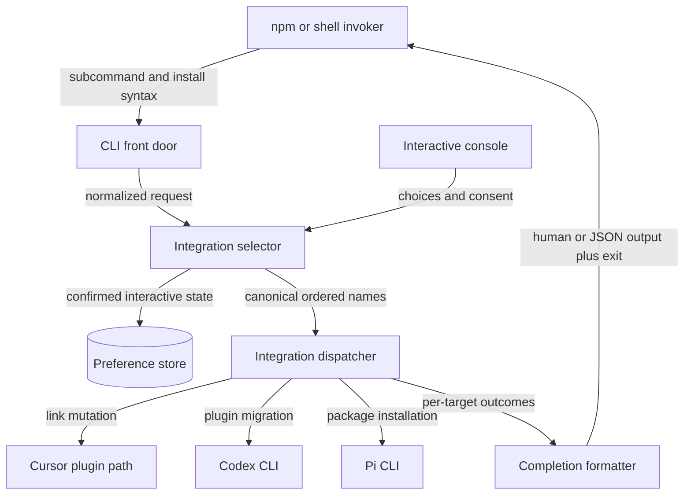

# `bin/csl-agent-kit.js` 组件状态地图

## Scope Summary

- **Scope**：`bin/csl-agent-kit.js`
- **HEAD**：`05a6c689e2344dc925b7dc111f02aa03750114f6`
- **Working tree**：`clean`
- **Generated at**：`2026-07-20T00:36:56+0800`

该文件是 `@ssbun/csl-agent-kit` 的 npm bin，也是 legacy shell wrapper 的实际 `install` 入口。它服务命令行调用者：接收多种 target 语法和安装/呈现 flags，按 registry、默认策略或交互授权解析有序 integrations，执行 Cursor symlink、Codex marketplace/plugin migration 或 Pi package install，再交付逐 target outcomes、人类/JSON 输出和退出状态；交互路径还保存已确认的选择。它不定义随包发布的 skills、hooks、commands 或 Pi extensions，也不接管 Codex、Cursor、Pi 内部安装语义（`package.json#bin`、`scripts/install.sh`、`bin/csl-agent-kit.js#main`、`.codex-plugin/plugin.json#skills`、`package.json#pi`）。

## Domain Glossary

| Term | Meaning here | Not the same as | Evidence |
| --- | --- | --- | --- |
| canonical target id | `targets` 中用于 validation、dispatch 和 result 的精确 key：`cursor`、`codex-plugin`、`pi` | title 或 description | `bin/csl-agent-kit.js#targets`、`bin/csl-agent-kit.js#validateTargets` |
| selection | 经过 selector precedence、validation 与稳定去重的有序 target id 数组 | interactive saved state；非交互选择不写该 state | `bin/csl-agent-kit.js#resolveInstallTargets`、`tests/cli-install-output.test.js:450` |
| change / result | change 描述 handler 内 effect；result 为 dispatcher 包装的一项 target 成败 | change action `skip` 不等于 failed result | `bin/csl-agent-kit.js#installTargets`、`bin/csl-agent-kit.js#summarizeChanges` |

## Functional Module Map



| Module | What it does | Inputs | Outputs | Owns | Code anchor | Tests |
| --- | --- | --- | --- | --- | --- | --- |
| CLI front door | 选择 install/help，归一 flags 与所有 target token 形式；install help 和语法错误在 resolver 前退出 | argv | options、help/error | command grammar、parse-time exits | `bin/csl-agent-kit.js#main`、`bin/csl-agent-kit.js#parseInstallArgs`、`bin/csl-agent-kit.js#splitTargets`、`bin/csl-agent-kit.js#die` | `tests/cli-install-output.test.js:200`、`:268`、`:276` |
| Integration selector | 依 all/explicit/yes/interactive 解析 target；验证与稳定去重，处理 TTY/CI、saved choices、external consent 和原子保存 | options、registry、environment、state、prompt response | ordered target ids；interactive preference | selection precedence、default/external policy、state schema | `bin/csl-agent-kit.js#targets`、`bin/csl-agent-kit.js#resolveInstallTargets`、`bin/csl-agent-kit.js#loadInstallSelection`、`bin/csl-agent-kit.js#saveInstallSelection` | `tests/cli-install-output.test.js:232`、`:250`、`:288`、`:306`、`:450` |
| Integration dispatcher | 按 selection 逐项调用 registry handler，将 changes/异常隔离为同序 results；实现三种平台 effects 与 dry-run | target ids、options、repo root、HOME/PATH | `{target,ok,changes|error}` 列表 | handler strategy、effect primitive、per-target failure isolation | `bin/csl-agent-kit.js#installTargets`、`bin/csl-agent-kit.js#installCursor`、`bin/csl-agent-kit.js#installCodexPlugin`、`bin/csl-agent-kit.js#installPi`、`bin/csl-agent-kit.js#runCommands` | `tests/cli-install-output.test.js:59`、`:324`、`:354`、`:377`、`:426` |
| Completion formatter | 从统一 results 精确分流 JSON/human；human 路径应用 color、summary 与 verbose details，最终确定整体状态 | results、json/color/verbose/dryRun | stdout、exit 0/1 | output contract、presentation、success predicate | `bin/csl-agent-kit.js#main`、`bin/csl-agent-kit.js#printResults`、`bin/csl-agent-kit.js#createColors`、`bin/csl-agent-kit.js#printChangeDetails` | `tests/cli-install-output.test.js:44`、`:78`、`:200`、`:208`、`:215`、`:222` |

## Core Working Flows

### 1. 非交互 install

```text
install → 多种 argv 语法 → CLI front door → Integration selector → Integration dispatcher → Completion formatter → stdout + exit
                           └→ parse/validation exit 2      └→ 单项异常成为失败 result；后续继续
```

1. `main` 只对首 token `install` 进入安装。`parseInstallArgs` 把 `--target value`、`--targets value`、`--target=value` 与位置 token 都汇入 `options.targets`；逗号值经 `splitTargets` trim/filter，出现顺序保留。`all`/`--all` 设置独立的 `options.all`，其 resolver 优先级高于 targets（`bin/csl-agent-kit.js#main`、`bin/csl-agent-kit.js#parseInstallArgs`、`bin/csl-agent-kit.js#splitTargets`）。
2. parser 遇 install help 输出 stdout/exit 0；未知 option 或缺 target value 经 `die` 写 stderr/exit 2。显式 target 到 resolver 后先 `validateTargets`，未知 id 同样在任何 handler 前退出 2（`bin/csl-agent-kit.js#parseInstallArgs`、`bin/csl-agent-kit.js#printInstallHelp`、`bin/csl-agent-kit.js#validateTargets`、`bin/csl-agent-kit.js#die`）。
3. `resolveInstallTargets` 按 all、explicit、yes、interactive early returns。all 取 registry 声明顺序；explicit 在 validation 后以 `Set` 稳定去重；yes 只取 `default:true` 的 `codex-plugin`。前三路不读写 preference（`bin/csl-agent-kit.js#resolveInstallTargets`、`bin/csl-agent-kit.js#targets`；`tests/cli-install-output.test.js:450`）。
4. `installTargets` 在循环内 try/catch 每个 handler，故 result 保持 selection 顺序，一个 throw 不终止后续 target（`bin/csl-agent-kit.js#installTargets`）。
5. `main` 在全部 results 返回后，以 `options.json` 精确选择 inline JSON serializer 或 `printResults`。JSON 顶层 ok 与最终 exit 都使用 `results.every(item => item.ok)`；human renderer 只在 verbose 时展开 changes（`bin/csl-agent-kit.js#main`、`bin/csl-agent-kit.js#printResults`、`bin/csl-agent-kit.js#printChangeDetails`；`tests/cli-install-output.test.js:222`）。

### 2. Interactive admission、授权与 state

```text
无执行 selector → TTY/CI admission → prompts + saved choices → selection → external consent → atomic save → dispatcher
                       └→ exit 2                            └→ 取消/拒绝：exit 2，零保存/effect
```

1. 只有 all/explicit/yes 均未命中才进入 interactive。非 TTY 或存在 CI 在加载 prompt/state 前退出 2（`bin/csl-agent-kit.js#resolveInstallTargets`）。
2. 通过 admission 后按需 `require("prompts")`，再由 `loadInstallSelection` 读取 v1 selectedTargets 并按当前 registry 过滤；缺失、非法或过滤后为空时，choices 回退 registry default（`bin/csl-agent-kit.js#loadInstallSelection`、`bin/csl-agent-kit.js#buildInstallChoices`；`tests/cli-install-output.test.js:232`、`:250`、`:288`、`:306`）。
3. multiselect 至少一项；所选含 `external:true` 的 Codex/Pi 才出现 confirm。取消或拒绝在 save/dispatch 前通过 `die` exit 2（`bin/csl-agent-kit.js#resolveInstallTargets`、`bin/csl-agent-kit.js#targets`）。
4. 授权后 `saveInstallSelection` 按 registry 顺序过滤，写 mode 0600 的同目录临时文件并 rename，finally 清理临时文件；保存异常只输出 warning，当前安装仍继续（`bin/csl-agent-kit.js#saveInstallSelection`、`bin/csl-agent-kit.js#installSelectionFile`、`bin/csl-agent-kit.js#resolveInstallTargets`）。

### 3. Handler effects 与 Codex migration

```text
canonical target → registry handler → dry-run plan / filesystem / process → changes → dispatcher result
                                  └→ handler throw：当前失败；后续 target 继续
```

1. Cursor 通过 `ensureSymlink` 管理用户路径：dry-run 只报告；真实模式拒绝普通文件，保持同源 link 不变，替换异源 symlink（`bin/csl-agent-kit.js#installCursor`、`bin/csl-agent-kit.js#ensureSymlink`）。
2. Codex/Pi 非 dry-run 先运行 `<command> --version`；status 不为 0 时正常返回 `skip`，所以 result 仍 ok。Pi operation 是 `pi install <repoRoot>`（`bin/csl-agent-kit.js#installCodexPlugin`、`bin/csl-agent-kit.js#installPi`、`bin/csl-agent-kit.js#hasCommand`）。
3. Codex command stage 依序包含六个 allow-failure remove 和两个 required add。dry-run 不 spawn；required add 普通非零使 `runCommands` throw。只有 command stage 全部返回后才进入 legacy cleanup，因此 plugin add 失败会保留旧 links（`bin/csl-agent-kit.js#installCodexPlugin`、`bin/csl-agent-kit.js#runCommands`；`tests/cli-install-output.test.js:59`、`:426`）。
4. cleanup 只遍历真实 `~/.agents/skills` 目录中的 symlink，并以词法/解析来源确认其属于 repo `skills` 根；dry-run 报告 remove，真实模式 unlink，普通/外部对象保持（`bin/csl-agent-kit.js#removeLegacyCodexSkillLinks`、`bin/csl-agent-kit.js#isWithin`；`tests/cli-install-output.test.js:324`、`:354`、`:377`）。

## Cross-flow Invariants

| Rule | Enforced at | Consequence when violated | Evidence |
| --- | --- | --- | --- |
| target token 先由 parser/split helper汇流，再 validation，最后稳定去重与 dispatch | `parseInstallArgs`、`splitTargets`、`resolveInstallTargets`、`validateTargets` | 未知 id 在 state/effect 前 exit 2；重复合法 id 只派发一次且保留首次顺序 | `bin/csl-agent-kit.js#parseInstallArgs`、`bin/csl-agent-kit.js#splitTargets`、`bin/csl-agent-kit.js#resolveInstallTargets` |
| registry 是 canonical ids、顺序、default/external、handler 与 help 文案的共同事实源 | `targets` 及消费者 | all/choices/help/result 不维护冲突名称或顺序 | `bin/csl-agent-kit.js#targets`、`bin/csl-agent-kit.js#printInstallHelp`、`bin/csl-agent-kit.js#installTargets` |
| dry-run 在 effect primitives 内截断真实副作用但保留 planned changes | `ensureSymlink`、`runCommands`、`removeLegacyCodexSkillLinks` | 不改 link、不 spawn operations、不删 legacy links | `bin/csl-agent-kit.js#ensureSymlink`、`bin/csl-agent-kit.js#runCommands`、`bin/csl-agent-kit.js#removeLegacyCodexSkillLinks` |
| 每个 selected target 产生一个同序 result；handler 正常 skip 是成功，throw 是失败 | `installTargets` | failure 不吞后续 result但使 overall ok false/exit 1；skip 可保持 exit 0 | `bin/csl-agent-kit.js#installTargets`、`bin/csl-agent-kit.js#main` |
| machine/human output 共享 results 与成功定义，presentation flags 不改变 effect | `main`、`printResults`、`createColors` | JSON 无 ANSI/verbose details；human 可着色/展开，二者 exit 一致 | `bin/csl-agent-kit.js#main`、`bin/csl-agent-kit.js#createColors`、`tests/cli-install-output.test.js:222` |
