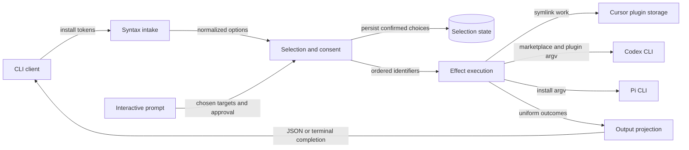

# `bin/csl-agent-kit.js` 当前开发地图

## Scope Summary

- **Scope**：`bin/csl-agent-kit.js`
- **HEAD**：`05a6c689e2344dc925b7dc111f02aa03750114f6`
- **Working tree**：`clean`
- **Generated at**：`2026-07-20T00:59:23+0800`

该文件是 `@ssbun/csl-agent-kit` 发布的 npm CLI 入口，也是兼容 wrapper 最终调用的 installer。它接收 command、target selectors、dry-run 和呈现 flags，解析有序 integration selection，必要时读取/确认/保存交互偏好，执行 Cursor link、Codex plugin migration 或 Pi install，并交付逐项 outcome、JSON/终端输出与进程状态。它不拥有被安装的 skills、hooks、commands、Pi extensions，也不实现外部客户端内部安装语义（`package.json#bin`、`scripts/install.sh`、`bin/csl-agent-kit.js#main`、`.codex-plugin/plugin.json#skills`、`package.json#pi`）。

## Domain Glossary

| Term | Meaning here | Not the same as | Evidence |
| --- | --- | --- | --- |
| target | `targets` registry 的 canonical key，连同 default/external metadata 和 handler 构成一项 integration strategy | terminal title 或文件路径 | `bin/csl-agent-kit.js#targets` |
| selection | 由 all、显式 target、yes 或 interactive 产生的有序 target key 列表 | 保存的交互偏好；显式安装不改该文件 | `bin/csl-agent-kit.js#resolveInstallTargets`、`tests/cli-install-output.test.js:450` |
| result | dispatcher 对某 target 的成功 changes 或失败 error 封装 | `skip` change；正常返回 skip 时 result 仍 `ok:true` | `bin/csl-agent-kit.js#installTargets`、`bin/csl-agent-kit.js#installCodexPlugin` |

## Functional Module Map



| Module | What it does | Inputs | Outputs | Owns | Code anchor | Tests |
| --- | --- | --- | --- | --- | --- | --- |
| Syntax intake | 选择 install/help，将多种 target token 与 flags 归一到固定 options；处理 parse help/error | argv | options 或直接输出/exit | CLI grammar、token splitting、parse-time exits | `bin/csl-agent-kit.js#main`、`bin/csl-agent-kit.js#parseInstallArgs`、`bin/csl-agent-kit.js#splitTargets`、`bin/csl-agent-kit.js#die` | `tests/cli-install-output.test.js:200`、`:268`、`:276` |
| Selection and consent | 依 all/explicit/yes/interactive 优先级解析 target，验证与稳定去重；处理 TTY/CI、saved state、external authorization 与原子保存 | options、registry、environment、state、prompt answer | ordered selected keys；interactive state | selection precedence、default/external policy、state schema | `bin/csl-agent-kit.js#targets`、`bin/csl-agent-kit.js#resolveInstallTargets`、`bin/csl-agent-kit.js#loadInstallSelection`、`bin/csl-agent-kit.js#saveInstallSelection` | `tests/cli-install-output.test.js:232`、`:250`、`:288`、`:306`、`:450` |
| Effect execution | 逐项调用 registry handler，将 changes/异常隔离为同序 results；执行 symlink、external commands、owned-link cleanup 和 dry-run | selected keys、options、repo root、HOME/PATH | `{target,ok,changes|error}` | handler mapping、effect boundary、per-target failure isolation | `bin/csl-agent-kit.js#installTargets`、`bin/csl-agent-kit.js#installCursor`、`bin/csl-agent-kit.js#installCodexPlugin`、`bin/csl-agent-kit.js#installPi`、`bin/csl-agent-kit.js#runCommands` | `tests/cli-install-output.test.js:59`、`:324`、`:354`、`:377`、`:426` |
| Output projection | 从同一 results 精确选择 JSON 或 human renderer；human 路径应用 colors、summary 与 verbose details，最后计算 exit | results、json/color/verbose/dryRun | stdout、exit 0/1 | output schema、terminal presentation、overall success predicate | `bin/csl-agent-kit.js#main`、`bin/csl-agent-kit.js#printResults`、`bin/csl-agent-kit.js#createColors`、`bin/csl-agent-kit.js#printChangeDetails` | `tests/cli-install-output.test.js:44`、`:78`、`:200`、`:208`、`:215`、`:222` |

## Core Working Flows

### 1. 参数到完成状态

```text
install → argv → Syntax intake → Selection and consent → Effect execution → Output projection → stdout + exit
                  └→ help/error exit     └→ validation/admission exit     └→ 单项失败不阻断后续
```

1. `main` 仅在 command 为 install 时进入主链。parser 将 `--target value`、`--targets value`、`--target=value` 和位置 token 经 `splitTargets` 追加到 `options.targets`；`all`/`--all` 使用独立布尔字段。未知 option、缺 target value 由 `die` 在 resolver 前 stderr/exit 2；install help stdout/exit 0（`bin/csl-agent-kit.js#main`、`bin/csl-agent-kit.js#parseInstallArgs`、`bin/csl-agent-kit.js#splitTargets`、`bin/csl-agent-kit.js#die`）。
2. `resolveInstallTargets` 依 all、explicit、yes、interactive early return。all 取 registry 顺序；explicit 先验证全部 id，再用 `Set` 保留首次出现；yes 只取 `default:true` 的 `codex-plugin`。前三路不读写 saved selection（`bin/csl-agent-kit.js#resolveInstallTargets`、`bin/csl-agent-kit.js#validateTargets`、`bin/csl-agent-kit.js#targets`；`tests/cli-install-output.test.js:450`）。
3. `installTargets` 的 try/catch 位于 target 循环内，每个选择恰好生成一项同序 result；handler throw 仅令当前项失败，后续仍执行（`bin/csl-agent-kit.js#installTargets`）。
4. 所有 results 返回后，`options.json` 精确分流 inline `JSON.stringify` 与 `printResults`。JSON 顶层 ok 和最终 exit 都用 `results.every(item => item.ok)`；human verbose 才展开 changes（`bin/csl-agent-kit.js#main`、`bin/csl-agent-kit.js#printResults`、`bin/csl-agent-kit.js#printChangeDetails`；`tests/cli-install-output.test.js:222`）。

### 2. 交互授权和偏好状态

```text
无 selector → TTY/CI → prompts → load/filter state → choose → external consent → atomic save → 主链
                 └→ exit 2                                   └→ reject/cancel：exit 2，零保存/effect
```

1. 只有 all/explicit/yes 都未命中才进入 interactive；非 TTY 或 CI 在加载 prompt/state 前退出 2（`bin/csl-agent-kit.js#resolveInstallTargets`）。
2. `loadInstallSelection` 接受 version 1 数组并按当前 registry 过滤；missing/invalid/过滤后为空返回 null，choices 回退 registry defaults（`bin/csl-agent-kit.js#loadInstallSelection`、`bin/csl-agent-kit.js#buildInstallChoices`；`tests/cli-install-output.test.js:232`、`:250`、`:288`、`:306`）。
3. 选择含 `external:true` 的 Codex/Pi 才显示确认。取消/拒绝在 state save 和 dispatch 前 `die`（`bin/csl-agent-kit.js#resolveInstallTargets`、`bin/csl-agent-kit.js#targets`）。
4. 授权后 `saveInstallSelection` 以 registry 顺序过滤，写 mode 0600 的同目录临时文件并 rename；保存失败只 warning，当前 selection 仍进入 dispatch（`bin/csl-agent-kit.js#saveInstallSelection`、`bin/csl-agent-kit.js#installSelectionFile`、`bin/csl-agent-kit.js#resolveInstallTargets`）。

### 3. 三种 integration effect

```text
selected key → registry handler → dry-run plan / filesystem / child process → changes → result
                                    └→ throw：当前失败；后续 integration 继续
```

1. Cursor handler 以 `repoRoot` 为 source 管理 HOME 下的 plugin link；dry-run 返回计划，真实模式拒绝普通文件、保持同源 link、替换异源 symlink（`bin/csl-agent-kit.js#installCursor`、`bin/csl-agent-kit.js#ensureSymlink`）。
2. Codex/Pi 真实模式先运行 `<command> --version`；不可用时正常返回 skip，result 因未抛错而成功。Pi operation 是 `pi install <repoRoot>`（`bin/csl-agent-kit.js#hasCommand`、`bin/csl-agent-kit.js#installCodexPlugin`、`bin/csl-agent-kit.js#installPi`）。
3. Codex 依序执行六个 allow-failure remove、required marketplace add、required plugin add，operation cwd 固定 `repoRoot`。dry-run 不 spawn；required nonzero throw，且 cleanup 位于全部 commands 返回之后，所以 add failure 保留旧 links（`bin/csl-agent-kit.js#runCommands`、`bin/csl-agent-kit.js#installCodexPlugin`；`tests/cli-install-output.test.js:59`、`:426`）。
4. cleanup 不经 child process，只检查 HOME 下真实 `.agents/skills` 目录中的 symlink，并以词法/解析来源限定 repo `skills` ownership；dry-run 只报告，真实模式 unlink（`bin/csl-agent-kit.js#removeLegacyCodexSkillLinks`、`bin/csl-agent-kit.js#isWithin`；`tests/cli-install-output.test.js:324`、`:354`、`:377`）。

## Cross-flow Invariants

| Rule | Enforced at | Consequence when violated | Evidence |
| --- | --- | --- | --- |
| target token 汇入同一数组后，显式分支先 validation 再稳定去重，最后 dispatch | parser、resolver、validator | unknown 在 state/effect 前 exit 2；重复合法 id 只执行一次并保留首次顺序 | `bin/csl-agent-kit.js#parseInstallArgs`、`bin/csl-agent-kit.js#resolveInstallTargets`、`bin/csl-agent-kit.js#validateTargets` |
| registry 是 canonical id/order/default/external/handler/help 的共同事实源 | `targets` 及 consumers | all/choices/help/result 不维护第二套 target 顺序 | `bin/csl-agent-kit.js#targets`、`bin/csl-agent-kit.js#printInstallHelp`、`bin/csl-agent-kit.js#installTargets` |
| dry-run 在 effect primitive 内短路真实变化，但仍生成可呈现 plan | `ensureSymlink`、`runCommands`、`removeLegacyCodexSkillLinks` | 不改 link、不 spawn operation、不删旧 links | `bin/csl-agent-kit.js#ensureSymlink`、`bin/csl-agent-kit.js#runCommands`、`bin/csl-agent-kit.js#removeLegacyCodexSkillLinks` |
| 每个 selection 产生一个同序 result；normal skip 成功、throw 失败 | handlers、dispatcher | failure 使 overall false/exit 1但不吞后续；skip 可保持 exit 0 | `bin/csl-agent-kit.js#installTargets`、`bin/csl-agent-kit.js#main` |
| process operation cwd 固定 repo root；probe继承调用进程 cwd；filesystem context来自 repoRoot/HOME | call sites | 单次 effect context 不修改全局 cwd/env，且平台路径来源保持可预测 | `bin/csl-agent-kit.js#repoRoot`、`bin/csl-agent-kit.js#hasCommand`、`bin/csl-agent-kit.js#runCommands`、`bin/csl-agent-kit.js#home` |
