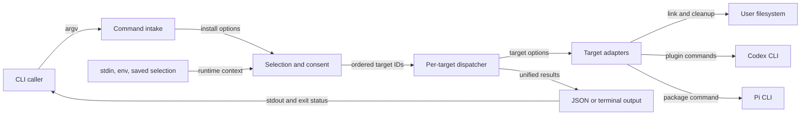

# CLI 安装组件当前状态地图

## Scope Summary

- **Scope**：`bin/csl-agent-kit.js`
- **HEAD**：`05a6c689e2344dc925b7dc111f02aa03750114f6`
- **Working tree**：`clean`
- **Generated at**：`2026-07-20T01:16:35+0800`

该文件是 npm binary 与旧版 shell wrapper 最终调用的安装入口，服务直接运行 `csl-agent-kit` 的用户及自动化脚本。它接收 argv、TTY/CI 状态、环境变量、交互回答和用户目录中的既有状态，完成安装参数解析、目标选择与授权、逐目标执行、结果聚合及人类/JSON 输出；交付 Cursor 本地链接、Codex plugin 注册与旧链接清理、Pi package 安装结果和进程退出状态。它不定义所安装 plugin、skill、hook 或 Pi extension 的运行行为，也不负责安装 npm 依赖或实现外部 CLI。[`package.json#bin`](package.json#bin) [`scripts/install.sh`](scripts/install.sh) [`bin/csl-agent-kit.js#main`](bin/csl-agent-kit.js#main)

## Domain Glossary

| Term | Meaning here | Not the same as | Evidence |
| --- | --- | --- | --- |
| target | `targets` registry 中具有稳定标识、展示 metadata 与 handler 的一个安装职责 | 任意命令行 token；token 必须先解析并验证 | [`bin/csl-agent-kit.js#targets`](bin/csl-agent-kit.js#targets) [`bin/csl-agent-kit.js#validateTargets`](bin/csl-agent-kit.js#validateTargets) |
| change | handler 返回、用于机器输出或终端摘要的可观察动作记录，如 `command`、`symlink`、`remove`、`skip` | 已执行成功的同义词；dry-run 和 successful skip 也会产生 change | [`bin/csl-agent-kit.js#runCommands`](bin/csl-agent-kit.js#runCommands) [`bin/csl-agent-kit.js#summarizeChanges`](bin/csl-agent-kit.js#summarizeChanges) |
| external | 仅用于交互选择后判断是否追加确认的 registry policy | handler 一定会启动进程；`cursor` 不启动，外部目标在 dry-run 或缺少 CLI 时也可能不启动 | [`bin/csl-agent-kit.js#targets`](bin/csl-agent-kit.js#targets) [`bin/csl-agent-kit.js#resolveInstallTargets`](bin/csl-agent-kit.js#resolveInstallTargets) |

## Functional Module Map



| Module | What it does | Inputs | Outputs | Owns | Code anchor | Tests |
| --- | --- | --- | --- | --- | --- | --- |
| Command intake | 区分 `install` 与通用帮助，并把 install token 解析为统一 options | `process.argv` | options，或直接帮助/错误退出 | 顶层入口、install 语法、缺值与未知 option 的边界 | [`bin/csl-agent-kit.js#main`](bin/csl-agent-kit.js#main) [`bin/csl-agent-kit.js#parseInstallArgs`](bin/csl-agent-kit.js#parseInstallArgs) [`bin/csl-agent-kit.js#splitTargets`](bin/csl-agent-kit.js#splitTargets) | [`tests/cli-install-output.test.js#test("Codex skill symlinks are no longer an install target or help option")`](tests/cli-install-output.test.js)；其余 front-door 分支未确认 |
| Selection and consent | 按 `all`、显式 targets、`yes`、交互的优先级解析有序目标；交互时加载预选、取得外部操作确认并保存选择 | options、TTY/CI、`prompts`、selection JSON | 有序 canonical target IDs，或 admission/authorization 直接退出 | 默认选择、显式验证、交互授权与 selection state | [`bin/csl-agent-kit.js#resolveInstallTargets`](bin/csl-agent-kit.js#resolveInstallTargets) [`bin/csl-agent-kit.js#loadInstallSelection`](bin/csl-agent-kit.js#loadInstallSelection) [`bin/csl-agent-kit.js#saveInstallSelection`](bin/csl-agent-kit.js#saveInstallSelection) | [`tests/cli-install-output.test.js#test("interactive checklist reuses the last confirmed selection")`](tests/cli-install-output.test.js) [`tests/cli-install-output.test.js#test("explicit target installs do not overwrite the saved interactive selection")`](tests/cli-install-output.test.js) |
| Per-target dispatcher | 按 selected 顺序调用 registry handler，把每项成功或抛错归一为结果并继续后续项 | target IDs、options、registry | `{target, ok, changes|error}` 的有序数组 | 目标级失败隔离与统一结果形状 | [`bin/csl-agent-kit.js#installTargets`](bin/csl-agent-kit.js#installTargets) | 单一目标失败有覆盖；失败后继续后续目标未确认：[`tests/cli-install-output.test.js#test("Codex plugin add failure leaves owned legacy links untouched")`](tests/cli-install-output.test.js) |
| Target adapters | 将 target 语义落实为链接、外部命令和受所有权约束的旧链接清理；dry-run 只返回计划 | options、`repoRoot`、HOME/PATH、文件系统与外部 CLI | change 数组或异常 | Cursor/Codex/Pi 的实际 effect 边界、Codex migration 顺序与清理范围 | [`bin/csl-agent-kit.js#installCursor`](bin/csl-agent-kit.js#installCursor) [`bin/csl-agent-kit.js#installCodexPlugin`](bin/csl-agent-kit.js#installCodexPlugin) [`bin/csl-agent-kit.js#installPi`](bin/csl-agent-kit.js#installPi) [`bin/csl-agent-kit.js#removeLegacyCodexSkillLinks`](bin/csl-agent-kit.js#removeLegacyCodexSkillLinks) | [`tests/cli-install-output.test.js#test("Codex plugin install migrates legacy identities")`](tests/cli-install-output.test.js) [`tests/cli-install-output.test.js#test("Codex plugin cleanup removes only owned links and is idempotent")`](tests/cli-install-output.test.js) |
| Output projection | 从同一结果数组选择 JSON 或终端呈现，应用 verbosity/color，并复用成功谓词决定退出状态 | results、output options、`NO_COLOR` | stdout 与状态 `0`/`1` | formatter 分流、终端摘要/细节、颜色和 completion | [`bin/csl-agent-kit.js#main`](bin/csl-agent-kit.js#main) [`bin/csl-agent-kit.js#printResults`](bin/csl-agent-kit.js#printResults) [`bin/csl-agent-kit.js#createColors`](bin/csl-agent-kit.js#createColors) | [`tests/cli-install-output.test.js#test("default install output is colorful and summarizes integrations without path noise")`](tests/cli-install-output.test.js) [`tests/cli-install-output.test.js#test("JSON output remains valid and color-free when --color is passed")`](tests/cli-install-output.test.js) |

## Core Working Flows

### 1. 非交互安装与结果投影

```text
install argv → 统一 options → Command intake → Selection and consent → Per-target dispatcher → Target adapters → Output projection
                                              └→ 解析/验证直接退出；单 target 异常转失败结果；任一失败使最终状态为 1
```

1. `main` 只在首 token 为 `install` 时进入 `parseInstallArgs`；parser 把 selector 与呈现 flag 收进统一 options，`--target`/`--targets`/`--target=` 和位置 target 都经 `splitTargets` 拆逗号、trim 并保持出现顺序。[`bin/csl-agent-kit.js#main`](bin/csl-agent-kit.js#main) [`bin/csl-agent-kit.js#parseInstallArgs`](bin/csl-agent-kit.js#parseInstallArgs) [`bin/csl-agent-kit.js#splitTargets`](bin/csl-agent-kit.js#splitTargets)
2. `resolveInstallTargets` 依次优先采用 `all`、显式 targets、`yes`；`all` 和默认集合按 registry 声明顺序产生，显式集合先验证再以 `Set` 稳定去重。未知 target 经 `die` 写 stderr 并以状态 `2` 退出，尚未读取 selection state 或执行 effect。[`bin/csl-agent-kit.js#resolveInstallTargets`](bin/csl-agent-kit.js#resolveInstallTargets) [`bin/csl-agent-kit.js#validateTargets`](bin/csl-agent-kit.js#validateTargets) [`bin/csl-agent-kit.js#die`](bin/csl-agent-kit.js#die)
3. `installTargets` 按 selected 顺序调用 registry 的 `run`；单项异常被转成 `ok: false`，不会在 dispatcher 层阻止后续 target。成功 handler 则以 `changes` 保留 dry-run、执行、unchanged 或 skip 的观察结果。[`bin/csl-agent-kit.js#installTargets`](bin/csl-agent-kit.js#installTargets)
4. `main` 在全部结果产生后，`json` 为真时直接输出无颜色 JSON；否则由 `printResults` 生成摘要，`verbose` 决定是否展开 change，`colorMode` 与 `NO_COLOR` 只控制终端 renderer。两条路径都用 `results.every(item.ok)` 决定整体 `ok`/状态 `0`，否则状态 `1`。[`bin/csl-agent-kit.js#main`](bin/csl-agent-kit.js#main) [`bin/csl-agent-kit.js#printResults`](bin/csl-agent-kit.js#printResults) [`bin/csl-agent-kit.js#printChangeDetails`](bin/csl-agent-kit.js#printChangeDetails)

### 2. 交互选择、授权与记忆

```text
无 selector/yes → TTY/CI admission → 加载 selection → checklist → external consent → 原子保存 → dispatcher
                                       └→ 无 TTY、缺 prompts、取消或拒绝均状态 2；保存失败仅 warning，继续安装
```

1. 只有 `all`、显式 targets 与 `yes` 都未命中时才进入交互分支；stdin 非 TTY 或存在 `CI` 会在加载状态前直接失败，随后才尝试加载 `prompts`。[`bin/csl-agent-kit.js#resolveInstallTargets`](bin/csl-agent-kit.js#resolveInstallTargets)
2. `loadInstallSelection` 仅接纳 version 1 数组，并按当前 registry 过滤、排序；无有效项时 `buildInstallChoices` 回退到 registry 默认。读取、JSON 或 schema 错误都被视为无状态，而不是安装失败。[`bin/csl-agent-kit.js#loadInstallSelection`](bin/csl-agent-kit.js#loadInstallSelection) [`bin/csl-agent-kit.js#buildInstallChoices`](bin/csl-agent-kit.js#buildInstallChoices)
3. checklist 至少选择一项；只要选择含 `external: true` 就显示确认。取消或未确认经 `die` 状态 `2`，因此 selection 写入与 target effects 均不可达。[`bin/csl-agent-kit.js#resolveInstallTargets`](bin/csl-agent-kit.js#resolveInstallTargets) [`bin/csl-agent-kit.js#targets`](bin/csl-agent-kit.js#targets)
4. 已确认选择通过同目录临时文件、mode `0600` 与 rename 保存；finally 清临时文件。保存异常只写 warning，仍返回选择进入 dispatcher。显式、all 与 yes 路径不会调用保存。[`bin/csl-agent-kit.js#saveInstallSelection`](bin/csl-agent-kit.js#saveInstallSelection) [`bin/csl-agent-kit.js#installSelectionFile`](bin/csl-agent-kit.js#installSelectionFile)

### 3. Codex plugin 注册与 owned legacy link 迁移

```text
codex-plugin → availability/dry-run → 顺序 CLI 命令 → owned-link scan → remove/report → changes
                                      └→ 必需 add 失败则 target 失败，cleanup 不可达；缺 CLI 是 successful skip
```

1. 非 dry-run 先以 `codex --version` 探测；不可用时正常返回 `skip` change，因此该 target 仍是 `ok: true`。dry-run 跳过探测，直接生成全部计划。[`bin/csl-agent-kit.js#installCodexPlugin`](bin/csl-agent-kit.js#installCodexPlugin) [`bin/csl-agent-kit.js#hasCommand`](bin/csl-agent-kit.js#hasCommand)
2. `runCommands` 以 `repoRoot` 为 cwd 顺序执行六个容许失败的旧身份/marketplace remove，再执行两个必须成功的 marketplace/plugin add。容许失败仍记录 status；必须步骤非零则抛错，`installTargets` 将整个 target 记为失败。[`bin/csl-agent-kit.js#installCodexPlugin`](bin/csl-agent-kit.js#installCodexPlugin) [`bin/csl-agent-kit.js#runCommands`](bin/csl-agent-kit.js#runCommands) [`tests/cli-install-output.test.js#test("Codex plugin install migrates legacy identities")`](tests/cli-install-output.test.js)
3. 只有命令阶段正常返回后才扫描 `~/.agents/skills`。清理仅处理 symlink，并要求链接文本或解析结果位于 `repoRoot/skills`；普通文件、目录、外部链接和 symlinked legacy root 保留。dry-run 报告而不 unlink，实际移除按排序后的目录项稳定产生。[`bin/csl-agent-kit.js#removeLegacyCodexSkillLinks`](bin/csl-agent-kit.js#removeLegacyCodexSkillLinks) [`bin/csl-agent-kit.js#isWithin`](bin/csl-agent-kit.js#isWithin) [`tests/cli-install-output.test.js#test("Codex plugin cleanup does not traverse a symlinked legacy skills directory")`](tests/cli-install-output.test.js)

## Cross-flow Invariants

| Rule | Enforced at | Violation consequence | Evidence |
| --- | --- | --- | --- |
| registry 声明顺序同时决定 `--all`、默认筛选、交互 choices、有效 target 列表和 help；显式 target 只在自身顺序内稳定去重 | `targets`、selection helpers、help renderer | 改变顺序或 metadata 会同时改变选择、呈现与派发，不只是文案 | [`bin/csl-agent-kit.js#targets`](bin/csl-agent-kit.js#targets) [`bin/csl-agent-kit.js#resolveInstallTargets`](bin/csl-agent-kit.js#resolveInstallTargets) [`bin/csl-agent-kit.js#printInstallHelp`](bin/csl-agent-kit.js#printInstallHelp) |
| dry-run 不执行链接、unlink 或 operation process，并且外部 target 不做 availability probe | 各 handler、`ensureSymlink`、`runCommands`、legacy cleanup | 若 effect primitive 绕过 guard，preview 会产生真实副作用或因本地 CLI 缺失而错误 skip | [`bin/csl-agent-kit.js#installCodexPlugin`](bin/csl-agent-kit.js#installCodexPlugin) [`bin/csl-agent-kit.js#installPi`](bin/csl-agent-kit.js#installPi) [`bin/csl-agent-kit.js#ensureSymlink`](bin/csl-agent-kit.js#ensureSymlink) [`bin/csl-agent-kit.js#runCommands`](bin/csl-agent-kit.js#runCommands) |
| target 级异常被隔离；整体成功只取决于统一 results 中每项 `ok`，successful skip 不算失败 | dispatcher 与 `main` 的共享谓词 | 一项失败若逃出 dispatcher 会丢失后续结果；若 renderer 自算状态会使 JSON、人类输出与退出码分歧 | [`bin/csl-agent-kit.js#installTargets`](bin/csl-agent-kit.js#installTargets) [`bin/csl-agent-kit.js#main`](bin/csl-agent-kit.js#main) |
| CLI 不修改全局 cwd/env；process operation 单次显式使用 `repoRoot` cwd，probe 继承调用进程 cwd，路径分别从 `repoRoot` 与 HOME 派生 | `repoRoot`、spawn 调用点与 path helpers | 上下文混用会令 probe、安装命令或用户文件落在错误 root | [`bin/csl-agent-kit.js#repoRoot`](bin/csl-agent-kit.js#repoRoot) [`bin/csl-agent-kit.js#runCommands`](bin/csl-agent-kit.js#runCommands) [`bin/csl-agent-kit.js#hasCommand`](bin/csl-agent-kit.js#hasCommand) [`bin/csl-agent-kit.js#home`](bin/csl-agent-kit.js#home) |
