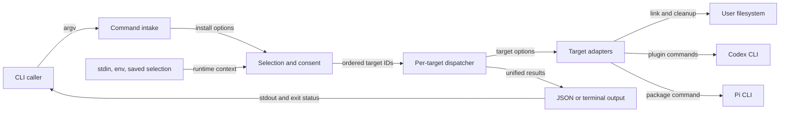

# CLI 安装组件当前状态地图

## Scope Summary

- **Scope**：`bin/csl-agent-kit.js`
- **HEAD**：`05a6c689e2344dc925b7dc111f02aa03750114f6`
- **Working tree**：`clean`
- **Generated at**：`2026-07-20T01:39:59+0800`

该文件是 npm binary 及兼容 shell wrapper 最终调用的安装入口，服务直接运行 `csl-agent-kit` 的用户与自动化脚本。它从 argv、TTY/CI、环境变量、交互回答和用户目录状态得到输入，负责解析安装请求、选择与授权 target、逐项执行、聚合结果并投影为终端或 JSON 输出；交付 Cursor 本地链接、Codex plugin 注册与 owned legacy link 清理、Pi package 安装结果及退出状态。它不定义安装后 plugin、skill、hook 或 Pi extension 的行为，也不安装 npm 依赖或实现外部 CLI。[`package.json#bin`](package.json#bin) [`scripts/install.sh`](scripts/install.sh) [`bin/csl-agent-kit.js#main`](bin/csl-agent-kit.js#main)

## Domain Glossary

| Term | Meaning here | Not the same as | Evidence |
| --- | --- | --- | --- |
| target | `targets` registry 中具有 stable ID、展示 metadata、policy 与 handler 的安装职责 | 任意位置 token；显式 token 必须先归一化并验证 | [`bin/csl-agent-kit.js#targets`](bin/csl-agent-kit.js#targets) [`bin/csl-agent-kit.js#validateTargets`](bin/csl-agent-kit.js#validateTargets) |
| change | handler 返回并供 JSON/terminal renderer 消费的动作记录 | 已实际成功变更的同义词；dry-run、unchanged 与 skip 也有 change | [`bin/csl-agent-kit.js#runCommands`](bin/csl-agent-kit.js#runCommands) [`bin/csl-agent-kit.js#summarizeChanges`](bin/csl-agent-kit.js#summarizeChanges) |
| external | 交互选择后是否需要二次确认的 registry policy | handler 必然启动进程；dry-run 与 missing CLI 分支都可能不启动 | [`bin/csl-agent-kit.js#targets`](bin/csl-agent-kit.js#targets) [`bin/csl-agent-kit.js#resolveInstallTargets`](bin/csl-agent-kit.js#resolveInstallTargets) |

## Functional Module Map



| Module | What it does | Inputs | Outputs | Owns | Code anchor | Tests |
| --- | --- | --- | --- | --- | --- | --- |
| Command intake | 区分 `install` 与通用帮助，将 install tokens 解析为统一 options | `process.argv` | options，或直接帮助/错误退出 | 顶层 command admission、install 语法及 parser exits | [`bin/csl-agent-kit.js#main`](bin/csl-agent-kit.js#main) [`bin/csl-agent-kit.js#parseInstallArgs`](bin/csl-agent-kit.js#parseInstallArgs) [`bin/csl-agent-kit.js#splitTargets`](bin/csl-agent-kit.js#splitTargets) | install help/unknown target 的一部分由 [`tests/cli-install-output.test.js#test("Codex skill symlinks are no longer an install target or help option")`](tests/cli-install-output.test.js) 验证；顶层 unknown 未确认 |
| Selection and consent | 依 precedence 解析有序 targets；交互时加载预选、取得 external 授权并保存选择 | options、TTY/CI、`prompts`、selection JSON | ordered stable IDs 或 admission/authorization exit | defaults、显式 validation/dedup、交互 state 与 consent | [`bin/csl-agent-kit.js#resolveInstallTargets`](bin/csl-agent-kit.js#resolveInstallTargets) [`bin/csl-agent-kit.js#loadInstallSelection`](bin/csl-agent-kit.js#loadInstallSelection) [`bin/csl-agent-kit.js#saveInstallSelection`](bin/csl-agent-kit.js#saveInstallSelection) | [`tests/cli-install-output.test.js#test("interactive checklist reuses the last confirmed selection")`](tests/cli-install-output.test.js) [`tests/cli-install-output.test.js#test("explicit target installs do not overwrite the saved interactive selection")`](tests/cli-install-output.test.js) |
| Per-target dispatcher | 按 selected 顺序调用 registry handler，把每项正常返回或异常归一为结果并继续循环 | IDs、options、registry | ordered `{target,ok,changes|error}` | target-level failure isolation 与统一 result shape | [`bin/csl-agent-kit.js#installTargets`](bin/csl-agent-kit.js#installTargets) | 单 target failure 有覆盖，失败后的后续 target 未确认：[`tests/cli-install-output.test.js#test("Codex plugin add failure leaves owned legacy links untouched")`](tests/cli-install-output.test.js) |
| Target adapters | 将 target 落为 symlink、外部命令与有 ownership 边界的清理；dry-run 返回计划 | options、repo/HOME/PATH、filesystem、Codex/Pi | change arrays 或异常 | Cursor/Codex/Pi effects、Codex migration 顺序与 cleanup 范围 | [`bin/csl-agent-kit.js#installCursor`](bin/csl-agent-kit.js#installCursor) [`bin/csl-agent-kit.js#installCodexPlugin`](bin/csl-agent-kit.js#installCodexPlugin) [`bin/csl-agent-kit.js#installPi`](bin/csl-agent-kit.js#installPi) [`bin/csl-agent-kit.js#removeLegacyCodexSkillLinks`](bin/csl-agent-kit.js#removeLegacyCodexSkillLinks) | [`tests/cli-install-output.test.js#test("Codex plugin install migrates legacy identities")`](tests/cli-install-output.test.js) [`tests/cli-install-output.test.js#test("Codex plugin cleanup removes only owned links and is idempotent")`](tests/cli-install-output.test.js) |
| Output projection | 从共享 results 选择 JSON 或 terminal renderer，并应用 verbosity/color 与统一成功谓词 | results、presentation options、`NO_COLOR` | stdout、status 0/1 | formatter split、summary/detail、color 与 completion | [`bin/csl-agent-kit.js#main`](bin/csl-agent-kit.js#main) [`bin/csl-agent-kit.js#printResults`](bin/csl-agent-kit.js#printResults) [`bin/csl-agent-kit.js#createColors`](bin/csl-agent-kit.js#createColors) | [`tests/cli-install-output.test.js#test("default install output is colorful and summarizes integrations without path noise")`](tests/cli-install-output.test.js) [`tests/cli-install-output.test.js#test("JSON output remains valid and color-free when --color is passed")`](tests/cli-install-output.test.js) |

## Core Working Flows

### 1. 非交互选择、安装与结果投影

```text
install argv → options → Command intake → Selection and consent → Per-target dispatcher → Target adapters → Output projection
                                     └→ parser/validation 状态 2；target 异常转失败结果；任一失败使最终状态 1
```

1. `main` 仅在首 token 为 `install` 时调用 `parseInstallArgs`；`--target`、`--targets`、`--target=` 与位置 target 都经 `splitTargets` 拆 comma、trim、过滤空值并按出现顺序追加。[`bin/csl-agent-kit.js#main`](bin/csl-agent-kit.js#main) [`bin/csl-agent-kit.js#parseInstallArgs`](bin/csl-agent-kit.js#parseInstallArgs) [`bin/csl-agent-kit.js#splitTargets`](bin/csl-agent-kit.js#splitTargets)
2. `resolveInstallTargets` 按 all → explicit → yes → interactive 的 precedence 早退。all/default 取 registry 声明顺序；explicit 先整体 validation，再以 `Set` 稳定去重。未知 target 经 `die` 写 stderr、status 2，state 与 effects 均不可达。[`bin/csl-agent-kit.js#resolveInstallTargets`](bin/csl-agent-kit.js#resolveInstallTargets) [`bin/csl-agent-kit.js#validateTargets`](bin/csl-agent-kit.js#validateTargets) [`bin/csl-agent-kit.js#die`](bin/csl-agent-kit.js#die)
3. `installTargets` 顺序调用 handler；每项 try/catch 将异常变成 `ok:false`，不会阻止下一 target。正常 handler 的 dry-run、executed、unchanged 或 skip 均保留为 changes。[`bin/csl-agent-kit.js#installTargets`](bin/csl-agent-kit.js#installTargets)
4. 全部 results 产生后，`json` 分支输出 `{ok,results}`；否则 `printResults` 输出 summary，`verbose` 决定 details，`colorMode`/`NO_COLOR` 只改变 terminal paint。两条路径均用 `results.every(item.ok)` 决定 status 0/1。[`bin/csl-agent-kit.js#main`](bin/csl-agent-kit.js#main) [`bin/csl-agent-kit.js#printResults`](bin/csl-agent-kit.js#printResults) [`bin/csl-agent-kit.js#printChangeDetails`](bin/csl-agent-kit.js#printChangeDetails)

### 2. 交互选择、external 授权与状态记忆

```text
无 execution selector → TTY/CI admission → load selection → checklist → external consent → temp/rename save → dispatcher
                                              └→ 无 TTY、缺 prompts、cancel/deny 状态 2；save failure 只 warning
```

1. 仅当 all、explicit、yes 都未命中才进入 interactive；非 TTY 或 CI 在 require `prompts` 与 state load 前失败，缺 dependency 也在 state 前失败。[`bin/csl-agent-kit.js#resolveInstallTargets`](bin/csl-agent-kit.js#resolveInstallTargets)
2. `loadInstallSelection` 只接纳 version 1 array，并按当前 registry 过滤与排序；读取、parse、schema 失败或无有效 ID 均回退默认 choices。[`bin/csl-agent-kit.js#loadInstallSelection`](bin/csl-agent-kit.js#loadInstallSelection) [`bin/csl-agent-kit.js#buildInstallChoices`](bin/csl-agent-kit.js#buildInstallChoices)
3. selected 含 `external:true` 才出现 confirm；cancel 或 denial 经 `die`，save/effects 不可达。已确认选择以同目录 temp、mode 0600、rename 发布，finally 删除 temp；保存失败只 warning，仍返回 selected。execution selectors 不调用 load/save。[`bin/csl-agent-kit.js#resolveInstallTargets`](bin/csl-agent-kit.js#resolveInstallTargets) [`bin/csl-agent-kit.js#saveInstallSelection`](bin/csl-agent-kit.js#saveInstallSelection) [`tests/cli-install-output.test.js#test("explicit target installs do not overwrite the saved interactive selection")`](tests/cli-install-output.test.js)

### 3. Codex plugin 注册与 legacy link migration

```text
codex-plugin → availability/dry-run → ordered CLI operations → owned-link scan → remove/report → changes
                                           └→ required add 失败则 cleanup 不可达；missing CLI 为 successful skip
```

1. live 先执行 `codex --version`；missing/nonzero probe 正常返回 skip，因此 target 仍 `ok:true`。dry-run 跳过 probe，直接生成八个 planned commands。[`bin/csl-agent-kit.js#installCodexPlugin`](bin/csl-agent-kit.js#installCodexPlugin) [`bin/csl-agent-kit.js#hasCommand`](bin/csl-agent-kit.js#hasCommand)
2. `runCommands` 以 repoRoot cwd 顺序执行六个允许失败的旧 identity/marketplace remove，再执行两个 required add；allowed nonzero 记录 status，required nonzero 抛错。此前已完成的 process effect 不回滚。[`bin/csl-agent-kit.js#installCodexPlugin`](bin/csl-agent-kit.js#installCodexPlugin) [`bin/csl-agent-kit.js#runCommands`](bin/csl-agent-kit.js#runCommands) [`tests/cli-install-output.test.js#test("Codex plugin install migrates legacy identities")`](tests/cli-install-output.test.js)
3. 仅在命令阶段正常返回后扫描 `HOME/.agents/skills`。只处理 symlink，且 link text 或 resolved target 必须位于 `realpath(repoRoot/skills)`；普通文件/目录、外部 links 与 symlinked legacy root 均保留。dry-run 只报告，live 按已排序 entries unlink。[`bin/csl-agent-kit.js#removeLegacyCodexSkillLinks`](bin/csl-agent-kit.js#removeLegacyCodexSkillLinks) [`bin/csl-agent-kit.js#isWithin`](bin/csl-agent-kit.js#isWithin) [`tests/cli-install-output.test.js#test("Codex plugin cleanup does not traverse a symlinked legacy skills directory")`](tests/cli-install-output.test.js)

## Cross-flow Invariants

| Rule | Enforced at | Violation consequence | Evidence |
| --- | --- | --- | --- |
| Registry 声明顺序共同决定 all、defaults、choices、state 过滤、valid-list、help 和 handler binding；explicit 仅在自身序列稳定去重 | `targets` 及其 consumers | 调整顺序/metadata 会同时改变选择、呈现与派发，而非只改文案 | [`bin/csl-agent-kit.js#targets`](bin/csl-agent-kit.js#targets) [`bin/csl-agent-kit.js#resolveInstallTargets`](bin/csl-agent-kit.js#resolveInstallTargets) [`bin/csl-agent-kit.js#printInstallHelp`](bin/csl-agent-kit.js#printInstallHelp) |
| dry-run 不做 target filesystem mutation、operation spawn 或 availability probe，只生成计划 | handlers 与 effect primitives | preview 若绕过 guard 会产生真实副作用或受本地 CLI availability 干扰 | [`bin/csl-agent-kit.js#installCodexPlugin`](bin/csl-agent-kit.js#installCodexPlugin) [`bin/csl-agent-kit.js#installPi`](bin/csl-agent-kit.js#installPi) [`bin/csl-agent-kit.js#ensureSymlink`](bin/csl-agent-kit.js#ensureSymlink) [`bin/csl-agent-kit.js#runCommands`](bin/csl-agent-kit.js#runCommands) |
| handler failure 只投影到自身 result；shared `every(ok)` 同时决定 JSON `ok` 与 process status，successful skip 不算失败 | dispatcher 与 `main` | 异常若逃出会丢失后续参与者；renderer 自算会导致机器/人类/exit 分歧 | [`bin/csl-agent-kit.js#installTargets`](bin/csl-agent-kit.js#installTargets) [`bin/csl-agent-kit.js#main`](bin/csl-agent-kit.js#main) |
| context 只随单次调用传播：probe 继承 caller cwd，operations 显式 repoRoot；filesystem roots 来自 repoRoot/HOME，不修改全局 cwd/env | spawn/path helpers | 混用会让 availability、安装命令或用户文件作用于错误 root | [`bin/csl-agent-kit.js#repoRoot`](bin/csl-agent-kit.js#repoRoot) [`bin/csl-agent-kit.js#hasCommand`](bin/csl-agent-kit.js#hasCommand) [`bin/csl-agent-kit.js#runCommands`](bin/csl-agent-kit.js#runCommands) [`bin/csl-agent-kit.js#home`](bin/csl-agent-kit.js#home) |
