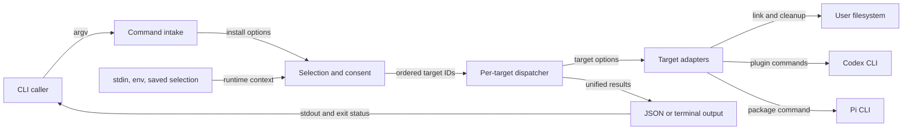

# CLI 安装组件当前状态地图

## Scope Summary

- **Scope**：`bin/csl-agent-kit.js`
- **HEAD**：`05a6c689e2344dc925b7dc111f02aa03750114f6`
- **Working tree**：`clean`
- **Generated at**：`2026-07-20T01:58:21+0800`

该文件是 npm binary 与兼容 shell wrapper 最终调用的安装入口，服务直接运行 `csl-agent-kit` 的用户和自动化脚本。它接收 argv、TTY/CI、环境变量、交互回答与用户目录状态，负责解析请求、选择 target、在交互路径取得 external 授权、逐项执行、聚合 results 并输出终端或 JSON；交付 Cursor 本地链接、Codex plugin 注册及 owned legacy-link 清理、Pi package 安装结果与退出状态。它不定义安装后的 plugin、skill、hook 或 Pi extension 行为，也不安装 npm 依赖或实现外部 CLI。[`package.json#bin`](package.json#bin) [`scripts/install.sh`](scripts/install.sh) [`bin/csl-agent-kit.js#main`](bin/csl-agent-kit.js#main)

## Domain Glossary

| Term | Meaning here | Not the same as | Evidence |
| --- | --- | --- | --- |
| target | `targets` registry 内具 stable ID、展示 metadata、selection policy 与 handler 的安装职责 | 任意位置 token；显式输入须先拆分与验证 | [`bin/csl-agent-kit.js#targets`](bin/csl-agent-kit.js#targets) [`bin/csl-agent-kit.js#validateTargets`](bin/csl-agent-kit.js#validateTargets) |
| external | 只在 interactive 最终选择后决定是否显示 confirm 的 registry policy | 所有执行路径都必须授权；all/explicit/yes 均在该 gate 前返回 | [`bin/csl-agent-kit.js#targets`](bin/csl-agent-kit.js#targets) [`bin/csl-agent-kit.js#resolveInstallTargets`](bin/csl-agent-kit.js#resolveInstallTargets) |
| change | handler 返回、供 JSON 或 terminal renderer 消费的动作记录 | 已完成 mutation；dry-run、unchanged 与 successful skip 也产生 change | [`bin/csl-agent-kit.js#runCommands`](bin/csl-agent-kit.js#runCommands) [`bin/csl-agent-kit.js#summarizeChanges`](bin/csl-agent-kit.js#summarizeChanges) |

## Functional Module Map



| Module | What it does | Inputs | Outputs | Owns | Code anchor | Tests |
| --- | --- | --- | --- | --- | --- | --- |
| Command intake | 区分 `install` 与通用帮助，把 install tokens 收敛为 options | argv | options 或 direct help/error exit | command admission、install syntax、parser exits | [`bin/csl-agent-kit.js#main`](bin/csl-agent-kit.js#main) [`bin/csl-agent-kit.js#parseInstallArgs`](bin/csl-agent-kit.js#parseInstallArgs) [`bin/csl-agent-kit.js#splitTargets`](bin/csl-agent-kit.js#splitTargets) | install help/invalid target 部分由 [`tests/cli-install-output.test.js#test("Codex skill symlinks are no longer an install target or help option")`](tests/cli-install-output.test.js) 验证；top-level unknown 未确认 |
| Selection and consent | 依 precedence 解析 ordered IDs；只在 interactive 路径加载/保存 state，并由最终 selected 的 external metadata 决定 confirm | options、TTY/CI、prompts、selection JSON | stable IDs 或 admission/authorization exit | defaults、validation/dedup、interactive state/consent | [`bin/csl-agent-kit.js#resolveInstallTargets`](bin/csl-agent-kit.js#resolveInstallTargets) [`bin/csl-agent-kit.js#loadInstallSelection`](bin/csl-agent-kit.js#loadInstallSelection) [`bin/csl-agent-kit.js#saveInstallSelection`](bin/csl-agent-kit.js#saveInstallSelection) | [`tests/cli-install-output.test.js#test("interactive checklist reuses the last confirmed selection")`](tests/cli-install-output.test.js) [`tests/cli-install-output.test.js#test("explicit target installs do not overwrite the saved interactive selection")`](tests/cli-install-output.test.js)；consent denial 未确认 |
| Per-target dispatcher | 按 selected 顺序调用 handler，把正常返回/异常归一为 result 后继续 | IDs、options、registry | ordered `{target,ok,changes|error}` | target-level failure isolation | [`bin/csl-agent-kit.js#installTargets`](bin/csl-agent-kit.js#installTargets) | 单 target failure 有覆盖，后续 participant 未确认：[`tests/cli-install-output.test.js#test("Codex plugin add failure leaves owned legacy links untouched")`](tests/cli-install-output.test.js) |
| Target adapters | 将职责落实为 symlink、external commands 与 ownership-constrained cleanup；dry-run 返回计划 | options、repo/HOME/PATH、filesystem、Codex/Pi | changes 或 throw | Cursor/Codex/Pi effects、migration order、cleanup ownership | [`bin/csl-agent-kit.js#installCursor`](bin/csl-agent-kit.js#installCursor) [`bin/csl-agent-kit.js#installCodexPlugin`](bin/csl-agent-kit.js#installCodexPlugin) [`bin/csl-agent-kit.js#installPi`](bin/csl-agent-kit.js#installPi) [`bin/csl-agent-kit.js#removeLegacyCodexSkillLinks`](bin/csl-agent-kit.js#removeLegacyCodexSkillLinks) | [`tests/cli-install-output.test.js#test("Codex plugin install migrates legacy identities")`](tests/cli-install-output.test.js) [`tests/cli-install-output.test.js#test("Codex plugin cleanup removes only owned links and is idempotent")`](tests/cli-install-output.test.js) |
| Output projection | 从 shared results 选择 JSON 或 terminal，应用 color/verbosity 并复用成功谓词 | results、presentation options、NO_COLOR | stdout、status 0/1 | formatter split、summary/detail、completion | [`bin/csl-agent-kit.js#main`](bin/csl-agent-kit.js#main) [`bin/csl-agent-kit.js#printResults`](bin/csl-agent-kit.js#printResults) [`bin/csl-agent-kit.js#createColors`](bin/csl-agent-kit.js#createColors) | [`tests/cli-install-output.test.js#test("default install output is colorful and summarizes integrations without path noise")`](tests/cli-install-output.test.js) [`tests/cli-install-output.test.js#test("JSON output remains valid and color-free when --color is passed")`](tests/cli-install-output.test.js) |

## Core Working Flows

### 1. 非交互选择、执行与输出

```text
install argv → options → Command intake → Selection and consent → Per-target dispatcher → Target adapters → Output projection
                                     └→ syntax/validation 状态 2；target throw 变失败 result；任一失败使最终状态 1
```

1. 首 token 只有 `install` 进入 parser。`--target`、`--targets`、`--target=` 和位置 target 都经 `splitTargets` 拆 comma、trim、过滤空项并依出现顺序追加；help 直接 status 0，unknown option/缺值经 `die` status 2。[`bin/csl-agent-kit.js#main`](bin/csl-agent-kit.js#main) [`bin/csl-agent-kit.js#parseInstallArgs`](bin/csl-agent-kit.js#parseInstallArgs) [`bin/csl-agent-kit.js#splitTargets`](bin/csl-agent-kit.js#splitTargets)
2. Resolver precedence 为 all → explicit → yes → interactive。all/default 按 registry order；explicit 先整体 validate，再以 `Set` stable dedup。unknown target 在 state/effects 前 stderr/status 2。all、explicit、yes 都是 execution selectors：直接返回 IDs，不加载/保存 state、不 prompt、也不进入 interactive external confirm；`--yes` 选择 defaults，并非 authorization-only flag。[`bin/csl-agent-kit.js#resolveInstallTargets`](bin/csl-agent-kit.js#resolveInstallTargets) [`bin/csl-agent-kit.js#validateTargets`](bin/csl-agent-kit.js#validateTargets)
3. Dispatcher 顺序调用 handler；每项 try/catch 把异常变成 `ok:false`，然后继续下一 target。正常 handler 的 dry-run、executed、unchanged 或 skip 保留为 changes。[`bin/csl-agent-kit.js#installTargets`](bin/csl-agent-kit.js#installTargets)
4. 全部 results 产生后，json 分支输出 `{ok,results}`；human 分支 summary 后按 verbose 展开 details，并只在 renderer 应用 color。两条路径用同一 `every(ok)` 决定 status 0/1。[`bin/csl-agent-kit.js#main`](bin/csl-agent-kit.js#main) [`bin/csl-agent-kit.js#printResults`](bin/csl-agent-kit.js#printResults)

### 2. Interactive selection、授权与记忆

```text
无 execution selector → TTY/CI admission → load state → checklist → selected external policy → confirm → temp/rename save → dispatcher
                                              └→ dependency/cancel/denial 状态 2；拒绝后 save/effects/results 不可达
```

1. 只有 all=false、targets empty、yes=false 才进入 interactive。非 TTY/CI 在 require prompts 与 state 前失败；依赖缺失同样在 state 前失败。[`bin/csl-agent-kit.js#resolveInstallTargets`](bin/csl-agent-kit.js#resolveInstallTargets)
2. State loader 只接受 version 1 array，按 registry filter/order；读取/parse/schema 失败或无有效 ID 回退 defaults。Checklist 至少一项，saved selection 只决定预选，不绕过 confirm。[`bin/csl-agent-kit.js#loadInstallSelection`](bin/csl-agent-kit.js#loadInstallSelection) [`bin/csl-agent-kit.js#buildInstallChoices`](bin/csl-agent-kit.js#buildInstallChoices)
3. Confirm type 由最终 selected 中是否存在 `targets[name].external` 派生：只选 cursor 不显示 confirm；选择 Codex/Pi 或 mixed 时显示。Cancel 或 external denial 经 `die` 写 stderr/status 2，selection save、dispatcher、results 均不可达。[`bin/csl-agent-kit.js#resolveInstallTargets`](bin/csl-agent-kit.js#resolveInstallTargets) [`bin/csl-agent-kit.js#targets`](bin/csl-agent-kit.js#targets)
4. Accepted selection 通过同目录 temp、mode 0600、rename 发布，finally rm temp；save error 只 warning 并继续 effects。保存时再次按 registry order/filter，不保存 unknown IDs。[`bin/csl-agent-kit.js#saveInstallSelection`](bin/csl-agent-kit.js#saveInstallSelection) [`bin/csl-agent-kit.js#installSelectionFile`](bin/csl-agent-kit.js#installSelectionFile)

### 3. Codex plugin operations 与 legacy migration

```text
codex-plugin → availability/dry-run → ordered commands → owned-link scan → remove/report → changes
                                           └→ required add failure makes cleanup unreachable；missing is successful skip
```

1. Live 先 `codex --version`；missing/nonzero probe 正常返回 skip，target 仍成功。Dry-run 跳过 probe，生成八 planned commands。[`bin/csl-agent-kit.js#installCodexPlugin`](bin/csl-agent-kit.js#installCodexPlugin) [`bin/csl-agent-kit.js#hasCommand`](bin/csl-agent-kit.js#hasCommand)
2. `runCommands` 以 repoRoot cwd 依次执行六 allowed-failure removes，再两个 required adds。Allowed nonzero 记录 status；required nonzero throw，已完成 effects 不回滚。[`bin/csl-agent-kit.js#runCommands`](bin/csl-agent-kit.js#runCommands) [`tests/cli-install-output.test.js#test("Codex plugin install migrates legacy identities")`](tests/cli-install-output.test.js)
3. Commands 正常返回后才 scan `HOME/.agents/skills`；仅移除 link text 或 resolved source 位于 `realpath(repoRoot/skills)` 的 symlink。普通 file/dir、external links、symlinked scan root 保留；dry-run 只报告。[`bin/csl-agent-kit.js#removeLegacyCodexSkillLinks`](bin/csl-agent-kit.js#removeLegacyCodexSkillLinks) [`bin/csl-agent-kit.js#isWithin`](bin/csl-agent-kit.js#isWithin) [`tests/cli-install-output.test.js#test("Codex plugin cleanup does not traverse a symlinked legacy skills directory")`](tests/cli-install-output.test.js)

## Cross-flow Invariants

| Rule | Enforced at | Violation consequence | Evidence |
| --- | --- | --- | --- |
| Registry order/metadata jointly drive all/default/choices/state/help/handler/results；explicit only stable-dedups its own order | registry and consumers | metadata/order change affects behavior, not just copy | [`bin/csl-agent-kit.js#targets`](bin/csl-agent-kit.js#targets) [`bin/csl-agent-kit.js#resolveInstallTargets`](bin/csl-agent-kit.js#resolveInstallTargets) [`bin/csl-agent-kit.js#printInstallHelp`](bin/csl-agent-kit.js#printInstallHelp) |
| Consent is interactive-only and derived after final selection；execution selectors authorize themselves by bypassing that path，`yes` selects defaults | resolver early returns and prompt type | moving policy earlier/later changes state/prompt/effect reachability | [`bin/csl-agent-kit.js#resolveInstallTargets`](bin/csl-agent-kit.js#resolveInstallTargets) |
| dry-run does no target fs mutation、operation spawn or availability probe；only source canonicalization/read-only cleanup scan may occur | handlers/primitives | preview otherwise mutates or depends on installed CLI | [`bin/csl-agent-kit.js#ensureSymlink`](bin/csl-agent-kit.js#ensureSymlink) [`bin/csl-agent-kit.js#installCodexPlugin`](bin/csl-agent-kit.js#installCodexPlugin) [`bin/csl-agent-kit.js#runCommands`](bin/csl-agent-kit.js#runCommands) |
| Handler throw is per-target result；shared `every(ok)` drives JSON ok and exit，skip is success | dispatcher/main | escaped errors drop later participants；separate predicates diverge output/exit | [`bin/csl-agent-kit.js#installTargets`](bin/csl-agent-kit.js#installTargets) [`bin/csl-agent-kit.js#main`](bin/csl-agent-kit.js#main) |
| Context is per call：probe inherits caller cwd，operation explicitly repoRoot；filesystem roots derive HOME/repoRoot；no global cwd/env mutation | spawn/path helpers | conflation targets wrong root/process context | [`bin/csl-agent-kit.js#hasCommand`](bin/csl-agent-kit.js#hasCommand) [`bin/csl-agent-kit.js#runCommands`](bin/csl-agent-kit.js#runCommands) [`bin/csl-agent-kit.js#home`](bin/csl-agent-kit.js#home) |
