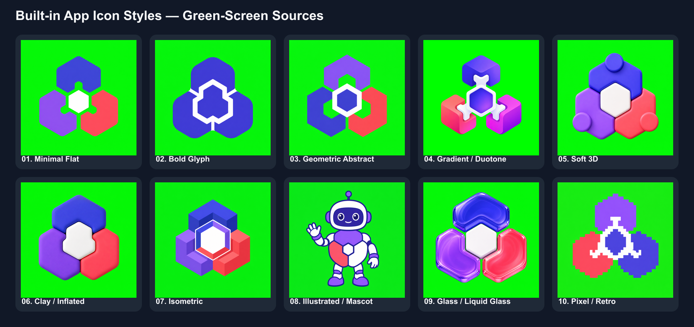

# Built-in App Icon Styles

Use this catalog only during **Determine the Style**. Style controls rendering; the app concept still controls the subject. Apply one preset unless the user explicitly asks for a hybrid.

## 1. Minimal Flat

- Character: crisp 2D vector-like geometry, solid fills, minimal detail, strong negative space.
- Prompt fragment: `minimal flat icon, crisp vector-like shapes, solid opaque colors, no gradients, bevels, texture, or shadows`

## 2. Bold Glyph

- Character: one heavy, instantly readable silhouette with very few internal cutouts.
- Prompt fragment: `bold glyph icon, single heavy opaque silhouette, high contrast, minimal cutouts, strong small-size legibility`

## 3. Geometric Abstract

- Character: precise circles, polygons, or interlocking modules arranged as a distinctive abstract mark.
- Prompt fragment: `abstract geometric icon, precise interlocking primitives, balanced symmetry, limited palette, crisp opaque silhouette`

## 4. Gradient / Duotone

- Character: two-color or restrained gradient treatment contained entirely inside simple opaque forms.
- Prompt fragment: `clean duotone icon, restrained two-color gradient contained inside the subject, simple opaque forms, crisp outer silhouette`

## 5. Soft 3D

- Character: satin material, rounded bevels, controlled depth, and lighting confined to the object.
- Prompt fragment: `polished soft 3D icon, satin opaque material, rounded bevels, controlled depth, soft object-only lighting, no cast shadow`

## 6. Clay / Inflated

- Character: chunky rounded forms with a playful matte polymer or inflated-toy appearance.
- Prompt fragment: `playful clay icon, chunky inflated rounded forms, matte opaque polymer, simple proportions, soft object-only shading`

## 7. Isometric

- Character: a compact object built on a consistent isometric grid with readable depth and no scene.
- Prompt fragment: `compact isometric icon, consistent 30-degree axes, clean block geometry, opaque materials, no floor plane or environment`

## 8. Illustrated / Mascot

- Character: one friendly character or emblem with a clean outline, limited detail, and expressive pose.
- Prompt fragment: `friendly illustrated mascot icon, one character or emblem, clean thick outline, limited detail, opaque colors, readable silhouette`

## 9. Glass / Liquid Glass

- Character: frosted glass-inspired volume with internal highlights and refraction-like detail.
- Prompt fragment: `opaque glass-inspired icon, frosted luminous volume, internal highlights and refraction-like detail confined inside the subject, crisp opaque outer silhouette, no background transmission or green reflection`
- Boundary: true transparent or background-transmitting glass is incompatible with the fixed green-screen Sharp workflow. Use this opaque approximation; do not claim native Liquid Glass transparency.

## 10. Pixel / Retro

- Character: deliberate low-resolution pixel clusters, limited palette, hard edges, and no smoothing.
- Prompt fragment: `retro pixel-art icon, deliberate low-resolution pixel grid, limited opaque palette, hard nearest-neighbor edges, no antialiasing`

## Custom

Use the user's own style specification. Preserve the same green-screen, approval, safe-zone, and output-validation rules as every preset.
