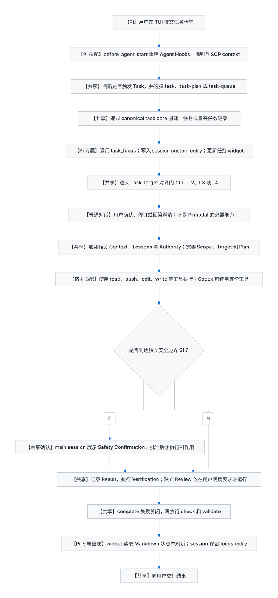
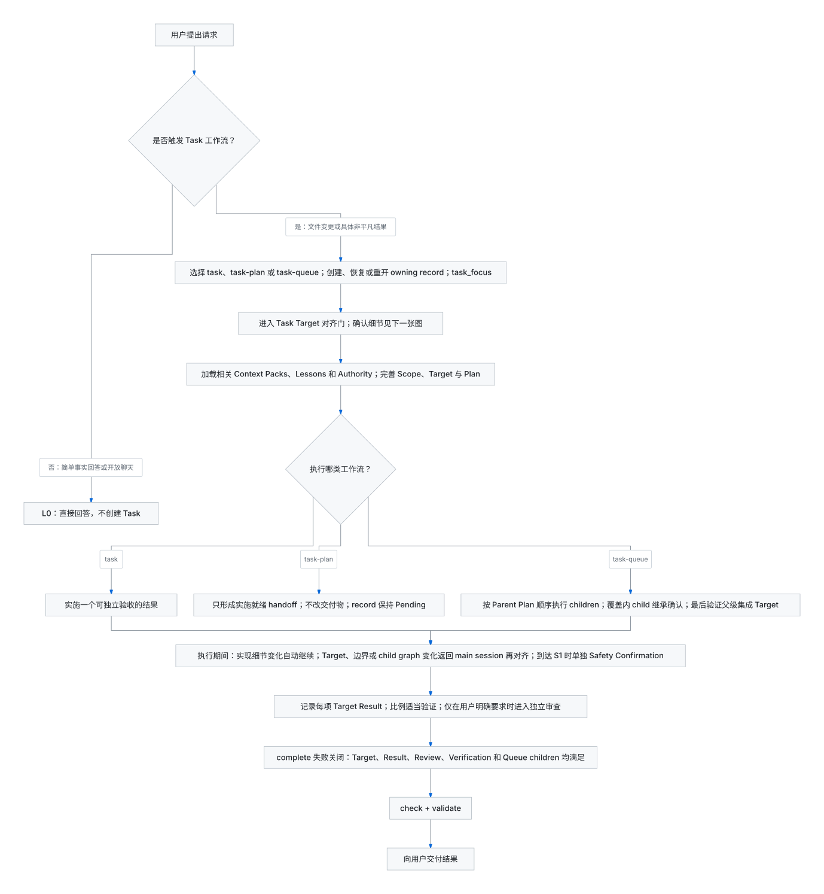
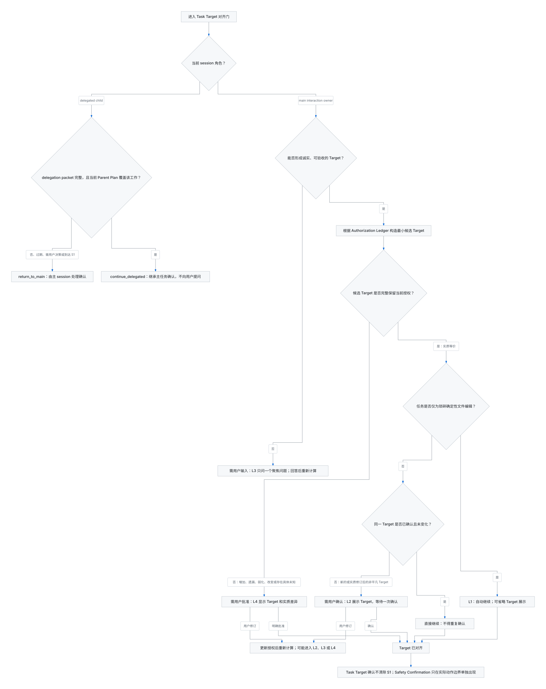

# Pi 中的 CSL Agent Kit Task 完整生命周期

## 1. 这套 Task 系统是什么

CSL Agent Kit 的 Task 系统是一套**跨宿主的目标驱动工作流**。它把一次任务拆成五个稳定阶段：

1. **Orient**：恢复工作区模型；
2. **Align**：把用户意图规范化为可验收的 Task Target；
3. **Prepare**：只加载相关 Context、Lessons 和权威来源；
4. **Execute**：执行最小且可追溯的变更；
5. **Verify**：记录证据，验证结果，并通过完成门禁。

它并不是 Pi 自带的通用任务管理器。系统的核心由共享 Skill、Task Target 协议、Node.js task core 和 Markdown 任务记录构成，因此 Codex、Claude Code 等宿主也能执行大部分流程。Pi 额外提供 session 关注绑定、TUI 任务面板、每轮上下文注入和 session entry 持久化。

### 1.1 文档标记

本文用以下标签区分能力归属：

| 标签 | 含义 |
|---|---|
| **【共享】** | CSL Agent Kit 的宿主无关语义；Pi、Codex 等都可执行。 |
| **【宿主适配】** | 目标和约束相同，但具体工具、Hook 或命令接口由宿主提供。 |
| **【Pi 适配】** | CSL Agent Kit 通过 Pi extension 对共享能力进行接入。 |
| **【Pi 专属】** | 当前实现依赖 Pi session、custom entry 或 TUI，Codex 默认没有同名能力。 |

### 1.2 三类状态必须分开

| 状态 | 权威载体 | 是否跨宿主共享 |
|---|---|---:|
| 任务结果、范围、Target、Plan、证据和状态 | `tasks/tasks/<task-id>.md` | 是 |
| 任务索引 | `tasks/tasks.md` | 是 |
| 当前 Pi session 关注哪个任务 | Pi session 中的 `csl-task-focus` custom entry | 否，仅当前 Pi session |
| L2/L4 是否已经在当前对话中获得接受 | 当前可恢复的会话上下文 | 不写入 task core |
| 稳定项目模型 | `tasks/context.md` | 是 |
| 可复用防错规则 | `tasks/lessons.md` | 是 |

Pi 的任务浮层只是 task Markdown 的只读视图；它不是任务状态的第二份权威来源。

---

## 2. 总览流程图

### 2.1 Pi 执行视角

下图中的每个节点都标出了共享、宿主适配或 Pi 专属边界。



### 2.2 宿主无关生命周期



### 2.3 Task Target 确认决策树



---

## 3. 阶段 0：Pi 启动与工作区定向

这一阶段发生在具体任务实质工作之前。

### 3.1 Pi runtime 初始化

**【Pi 适配】** Pi 加载已启用的 Skills 和 extensions。核心生命周期顺序包括：

```text
Pi 启动
  → project_trust
  → session_start
  → resources_discover
  → 用户提交 prompt
  → input / skill expansion
  → before_agent_start
  → agent turn 与工具调用
```

项目级 extension 只有在工作区被信任后才会加载。CSL Agent Kit 的 Pi package 暴露共享 `skills/` 和 Pi 专属 `pi/extensions/`。

### 3.2 每个 Agent turn 的规则注入

**【Pi 适配】** `csl-context-hooks.ts` 在 `before_agent_start`：

1. 重新读取可用 SOP；
2. 运行 `session-start` 和 `prompt-submit` Agent Hooks；
3. 组合 Agent Rules、工作区工作流契约和 SOP candidates；
4. 把结果追加到本轮 system prompt。

Codex 和 Claude Code 也能获得同一套稳定工作流契约，但当前分发方式主要在 SessionStart 注入；Pi 则在每个 Agent turn 前重新构建相关 context。

### 3.3 Project Core

**【共享】** 在 session start、resume 或 compaction 后，Agent 先通过 `task-context` 加载 `Project Core`。这里包含项目目的、全局词汇、系统边界和全局不变量。

- Context 已存在且有效：直接加载；
- Context 已存在但不是标准格式：从最小权威来源重建并验证；
- Context 缺失：展示完整的最小文件提案，获得用户确认后才创建；
- Context 与权威来源冲突：以权威来源为准。

此时只加载 Project Core，不读取全部 Context Packs。

---

## 4. 阶段 1：用户提交任务请求

### 4.1 Pi 接收 prompt

**【Pi 适配】** 用户在 Pi TUI 输入请求后，Pi 先检查 extension command，再触发 `input`、Skill／template expansion 和 `before_agent_start`，随后进入 Agent loop。

Task Target 的 L2/L4 确认默认通过**普通对话消息**完成，并不要求使用 Pi 的 `ctx.ui.confirm()` modal。Codex 也可以用普通对话完成相同确认语义。

### 4.2 判断是否触发 Task 工作流

**【共享】** 满足任一条件即触发 Task：

- 用户请求创建、修改、移动、重命名或删除任何文件；
- 用户请求一个具体、非平凡、可独立验收的结果。

以下情况通常不创建 Task：

- 简单事实回答；
- 尚未形成具体结果的开放讨论；
- 不改文件的琐碎确定性只读操作；
- 本身不是用户交付物的例行 Context 或 Lesson 维护。

### 4.3 选择 task family

**【共享】** 根据请求结果选择一个入口：

| Skill | 适用场景 | 产物 |
|---|---|---|
| `task` | 实现一个可独立验收的结果 | 完成后的 canonical task record 和交付物 |
| `task-plan` | 只调查、决策和规划，不修改请求交付物 | implementation-ready handoff，记录保持 Pending |
| `task-queue` | 用户要求自动管理多个有顺序或依赖关系的结果 | Queue parent、ordered children 和最终集成验证 |

一个新的、可独立验收的 outcome 默认拥有独立任务。仅仅涉及相同组件、文件或主题，不足以复用旧任务。

---

## 5. 阶段 2：激活 canonical task

### 5.1 最小 ownership 查询

**【共享】** 在 Target 对齐前，只允许：

1. 加载 Project Core；
2. 阅读最新任务索引；
3. 阅读少量可能拥有同一 outcome 的候选记录；
4. 执行 create、resume、reopen、focus、sync、check 等生命周期动作；
5. 在无法形成诚实 Target 时询问一个聚焦问题。

此时禁止阅读任务直接源码、研究实现、制定算法、分解 Queue、委派或修改交付物。

### 5.2 创建、恢复或重开

**【共享】** task core 通过以下命令维护记录：

```bash
CLI=skills/meta/csl-tasks/shared/scripts/csl-tasks.js

node "$CLI" --workspace <workspace> create <id> \
  --title '<title>' \
  --kind task \
  --target 'T1: <observable result>'

node "$CLI" --workspace <workspace> resume <id>
node "$CLI" --workspace <workspace> reopen <id>
```

选择规则：

- 新 outcome：`create`；
- Pending、Blocked 或 Cancelled：`resume`；
- 已完成任务的同一 outcome 需要直接修正、补全或重新验证：`reopen`；
- task record 与索引冲突时，以 task record 为权威。

任务记录创建不代表交付物执行已获得授权。它只是后续 Target 对齐所需的生命周期写入。

### 5.3 绑定当前 Pi session

**【Pi 专属】** 创建、恢复或重开任务后，Agent 调用：

```text
task_focus(<task-id>)
```

`task_focus` 由 `csl-task-overlay.ts` 注册，执行时会：

1. 校验 task ID 符合 canonical 格式；
2. 确认任务存在于当前工作区索引；
3. 使用 `pi.appendEntry()` 写入 `csl-task-focus` custom entry；
4. 刷新当前 session 的 task widget。

该 custom entry 不进入 LLM context，也不修改 canonical task record。它只表达“这个 Pi session 当前关注哪个任务”。

Pi 还提供人工命令：

```text
/task-focus <task-id>
/task-focus clear
/tasks
```

**Codex 对应边界：** Codex 可以执行相同 task core 命令并维护 Markdown 记录，但当前 CSL 实现没有 Pi 的 `task_focus` custom tool、session custom entry 和 TUI widget。宿主没有 focus 机制时，共享 Task 工作流仍可继续，但 Agent 应披露无法绑定。

---

## 6. 阶段 3：Task Target 对齐

### 6.1 Authorization Ledger

**【共享】** Agent 先从以下来源构造只存在于当前 session 的 Authorization Ledger：

- 用户最初请求；
- 聚焦澄清的回答；
- 用户后续明确新增或修订；
- 已被用户接受的 Task Target。

后出现的明确用户表达覆盖冲突的旧表达。Agent 假设、实现便利、仓库发现和未接受建议不能成为授权。

每个 commitment atom 属于以下类型之一：

- outcome；
- done conditions；
- scope；
- preserved behavior；
- compatibility；
- side effects；
- trade-offs。

### 6.2 Target readiness

Target 必须同时满足：

1. 只有一个可独立验收的 outcome；
2. 至少有一个真实、可观察的完成条件；
3. 保留用户明确给出的范围、兼容性和副作用边界；
4. 不把 Agent 选择的文件、算法、命令或验证方式提升成用户承诺。

如果用户自己的决策缺失导致无法形成诚实 Target，进入 L3，而不是猜测。

### 6.3 L0–L4 决策

| Level | 名称 | 触发条件 | 用户交互 |
|---|---|---|---|
| L0 | `NO_TASK` | 不改文件且没有具体非平凡 outcome | 不展示 Target，直接回答 |
| L1 | `TRIVIAL_PASS` | 仅琐碎确定性文件编辑，且 Target 实质等价 | 可省略展示并自动继续 |
| L2 | `VISIBLE_CHECKPOINT` | 新的或实质修订后的非平凡 Target，完整保留现有授权 | 展示 Target，等待一次明确接受 |
| L3 | `CLARIFICATION_HOLD` | 用户歧义阻止诚实 Target | 只问一个聚焦问题，不展示猜测 Target |
| L4 | `TARGET_CHANGE_APPROVAL` | 候选 Target 增加、遗漏、弱化或改变了承诺 | 展示 Target、实质差异并等待批准 |

L2 和 L4 都会暂停，但含义不同：

- L2：核对 Agent 是否正确理解已有授权；
- L4：请求用户批准一个改变后的授权。

### 6.4 用户可见格式

L2 和 L4 使用同一主体：

```markdown
**Task Target**

- **结果：** <用户可见或系统可观察的结果>
- **完成条件：**
  - <可观察条件>
- **边界：** <只有容易误解时才显示>
```

L4 额外列出发生变化的 commitment dimensions。Target 不应包含文件清单、算法、命令序列或内部 Plan。

### 6.5 防止重复确认

**【共享】** 以下情况不得重复展示 L2：

- 同一 main Target 已接受且未变化；
- 只改变文件、函数、算法、命令或验证方式；
- delegated child 完全被当前已接受的 Parent Plan 覆盖。

以下情况重新进入对齐门：

- 用户修订 outcome、完成条件或边界；
- Agent 或调查发现需要改变用户承诺；
- Queue 的 child 数量、顺序、outcome、done conditions 或 scope 发生实质变化；
- resume 或 compaction 后无法恢复明确的接受证据。

“是否准备进入实现阶段”不是 Task 系统要求的独立通用确认。如果之后仍要展示正式 L2，它会制造重复确认。正确做法是直接让实现 Target 承担那一次确认，或者在同一已接受且未变化的 Target 上继续。

---

## 7. 阶段 4：对齐后的准备

只有 Target 已对齐后，Agent 才进入 Prepare。

### 7.1 读取相关 Context Packs

**【共享】** Agent 根据 outcome、artifact、domain、约束和组件边界构造 Task Fingerprint，然后：

1. 查看 Context Pack index；
2. 通常选择一到三个直接相关 Pack；
3. 完整读取选中的 Pack；
4. 在重要决策前核实 Pack 指向的 Authority；
5. Authority 与 Context 冲突时，以 Authority 为准。

Context 用于减少宽泛探索，不能替代任务源码、测试、schema、配置或正式决策。

### 7.2 读取相关 Lessons

**【共享】** Agent 使用 trigger-first 查询加载相关 Lesson，应用每个匹配的 Rule，并在结束时验证对应 Check。

用户纠正后必须重新查询。只有当一个错误模式可复用、可预判、可防止且仍依赖 Agent 判断时，才适合写入 Lesson。任何持久 Add、Update、Merge、Replace 或 Delete 都必须先展示精确记录或 diff 并获得确认。

### 7.3 检查直接权威来源

**【宿主适配】** Agent 再读取任务直接相关的源码、测试、配置、文档或外部权威来源。Pi 常用 `read`、`bash`、MCP 和 web tools；Codex 可以使用自己的等价工具。

### 7.4 完善任务记录

**【共享】** 根据已确认事实补充：

- `Scope`：容易误加的相邻边界；
- `Target`：稳定、可观察、可判定的结果；
- `Plan`：结果节点、依赖和下一步；
- `Decisions`：仅记录已经确定且执行必须保留的选择。

更新后运行：

```bash
node "$CLI" --workspace <workspace> sync <id>
node "$CLI" --workspace <workspace> check <id>
```

---

## 8. 阶段 5：执行

### 8.1 单任务 `task`

**【共享】** `task` 实现一个 outcome：

1. 理解真实控制流；
2. 优先复用已有实现、标准库或平台能力；
3. 修改最少文件；
4. 不进行无关重构或格式化；
5. 删除因本次改动产生的孤儿代码；
6. 让每一行改动都可追溯到 Target 或验证。

**【宿主适配】** 在 Pi 中通常通过 `read`、`bash`、`edit`、`write` 等工具执行；Codex 有等价的读取、shell 和补丁工具。具体工具名不是 Task 语义的一部分。

### 8.2 只读规划 `task-plan`

**【共享】** `task-plan` 只调查和形成 implementation-ready handoff：

- 可以更新 task record；
- 不修改产品代码、配置或用户请求的其他交付物；
- Target 描述最终交付物的稳定验收条件；
- Plan 只保留结果节点、依赖和验证点；
- 实施尚未发生，因此不记录实施 Result 或 Verification；
- 记录保持 Pending。

用户以后明确要求实施时，同一 record 交给 `task` 恢复，并重新应用 Target 对齐规则。这里不需要再插入一个通用的“是否准备开始”确认。

### 8.3 多任务 `task-queue`

**【共享】** Queue 的执行顺序是：

1. 创建一个 Queue parent，先对齐父级集成 Target；
2. 对齐后才分解 children；
3. 每个 child 必须有独立可验收或可阻塞的 outcome；
4. Parent Plan 按顺序命名全部 child IDs；
5. 使用 `link <parent-id> <child-id>` 建立有序图；
6. `next <parent-id>` 选择第一个未完成 child；
7. 当前 child 完成后才进入下一个；
8. 所有 children 完成后，父级仍需独立验证集成 Target。

### 8.4 delegated child

**【共享】** child 或 subagent 只有收到完整 delegation packet 才能自动继续。packet 至少包含：

- main task ID；
- owning child ID 或当前 Plan node；
- exact outcome；
- observable done conditions；
- scope 和 boundaries。

若 assignment 被当前 Parent Plan 完整覆盖，child 使用 `continue_delegated`，不向用户展示 Target。以下情况使用 `return_to_main`：

- packet 缺失或过期；
- assignment 超出 Plan；
- 需要用户决策；
- 到达 S1；
- child graph 需要实质变化。

只有 main interaction owner 可以向用户展示 L2、L3、L4 或 Safety Confirmation。

---

## 9. 阶段 6：执行中的重新对齐与安全边界

### 9.1 实现细节变化

以下变化不触发确认：

- 换一个内部文件；
- 改用另一种算法；
- 换验证命令；
- 在同一 child node 内调整实现顺序。

前提是 accepted result、done conditions 和 boundaries 没有变化。

### 9.2 结果或边界变化

- 用户修订后仍有歧义：L3；
- 用户修订已经明确，规范化后的新非平凡 Target：重新展示一次 L2；
- Agent 或发现引入额外承诺：L4；
- material child-distribution graph change：返回 main session，根据差异进入 L2、L3 或 L4。

任何相关 deliverable 变化都会使旧 Result 或 Verification 证据失效，必须重新验证。

### 9.3 S0／S1 Safety Overlay

**【共享】** Safety 与 L0–L4 正交：

- S0：没有额外安全确认；
- S1：发布、付费、破坏性操作、凭据、权限、隐私数据、部署或其他外部副作用受独立流程约束。

L2/L4 只对齐任务目标，不能授权 S1 动作。真正到达动作边界时，main session 单独展示：

```markdown
**Safety Confirmation**

- 操作
- 影响对象
- 后果
- 依据规则
```

**【Pi 边界】** 这个区块通常仍通过普通 Agent 对话展示。Pi extension 可以使用 `ctx.ui.confirm()` 实现 modal，但 Task 协议不依赖 modal，Codex 也能在普通对话中完成同样的安全确认。

---

## 10. 阶段 7：结果证据、验证和完成

### 10.1 为每个 Target 记录 Result

**【共享】** 每个 `Tn` 都必须有一条可追溯证据：

```bash
node "$CLI" --workspace <workspace> result <id> T1 \
  --evidence '<what was checked, how, and observed result>'
```

core 根据 Result 自动勾选对应 Target；Agent 不应手工修改 checkbox。

### 10.2 Verification

Agent 运行与风险成比例的确定性检查，并记录：

```bash
node "$CLI" --workspace <workspace> verify <id> passed \
  --evidence '<observed verification>'
```

失败的验证阻塞 completion。修改交付物后，旧验证可能失效，必须替换为最新证据。具体可运行哪些命令受用户规则、项目规则和安全边界约束。

### 10.3 Review gate

独立 adversarial review 只在用户明确要求时运行：

```bash
node "$CLI" --workspace <workspace> review <id> skipped \
  --evidence '用户未要求独立审查'
```

如果用户要求：

1. 标记 review 为 required；
2. 状态进入 In Review；
3. 运行独立 Reviewer 流程；
4. 批准后记录 approved；
5. 若 review 修改 deliverable，返回 In Progress，重新生成 Result 和 Verification。

普通自审、测试、proofreading 或风险较高都不会自动触发独立 review。

### 10.4 Completion gate

`complete` 是进入 Completed 的唯一入口：

```bash
node "$CLI" --workspace <workspace> complete <id>
node "$CLI" --workspace <workspace> check <id>
node "$CLI" --workspace <workspace> validate
```

core 会 fail closed；以下任一情况存在时拒绝完成：

- 有未满足 Target；
- 缺少 Result；
- Verification 未通过；
- review gate 缺失或未批准；
- 仍有 Block；
- Queue child 尚未完成；
- Queue parent 缺少自身的集成证据。

完成前还要检查相关 Context Pack 是否因本次工作产生稳定事实变化，以及 selected Lessons 的 Check 是否满足。

### 10.5 Pi 完成后的呈现

**【Pi 专属】** task widget 每五秒重读 task index 和可见 Target progress：

- 当前 focused task 显示在 `This Session`；
- 其他近期任务显示在 `Workspace`；
- TUI 支持时，标题使用 OSC 8 链接到 canonical task 文件；
- 任务完成后仍保持 focus，直到新任务替换或用户清除；
- headless 模式不注册 widget；
- RPC 保持可序列化文本，不依赖 TUI grouping。

widget 不决定完成状态；它只显示 task core 已写入 Markdown 的结果。

---

## 11. 状态模型

| 状态 | 含义 | 常见进入方式 |
|---|---|---|
| Pending | 已建立但尚未执行，或 `task-plan` handoff 等待实施 | create、规划交接 |
| In Progress | 正在准备或执行 | resume、reopen |
| In Review | 显式请求的独立 review 正在进行 | review required |
| Blocked | 有明确原因与可观察解除条件 | status blocked |
| Cancelled | 可逆软停止，不代表完成 | cancel |
| Completed | 所有完成门禁满足 | complete |

Cancelled 可以 resume；Completed 只有在修正、补全或重新验证同一 outcome 时 reopen。

---

## 12. Pi 与 Codex 能力对照

| 流程环节 | Pi 当前实现 | Codex 可实现情况 |
|---|---|---|
| 共享 Skills | Pi package 暴露 `skills/`，并有 `/skill:<name>` 与别名 | Codex plugin 提供同一共享 Skills |
| 工作流契约注入 | `before_agent_start` 每轮重建 Agent Hooks、规则和 SOP context | Codex plugin 在 SessionStart 注入工作流契约，并在 UserPromptSubmit 注入 SOP candidates |
| canonical task core | 使用 shell 调用同一 Node.js CLI | 可调用同一 CLI |
| task Markdown | 工作区文件，跨宿主共享 | 完全共享 |
| Task Target L0–L4 | 普通 Agent 对话 | 普通 Agent 对话，语义相同 |
| S1 Safety Confirmation | 普通对话；可选 Pi modal 实现 | 普通对话或宿主确认能力 |
| 文件与命令执行 | Pi `read`、`bash`、`edit`、`write` 等 | Codex 等价工具 |
| session task focus | **Pi 专属** `task_focus` + custom entry | 当前 CSL Codex plugin 无同名机制；可另行实现类似 binding |
| task widget | **Pi 专属** TUI widget、`/tasks`、可点击标题 | 当前没有 Pi TUI widget；可通过其他 UI 或报告替代 |
| focus 恢复 | `session_start`／`session_tree` 从 Pi branch 恢复 custom entry | 依赖 Codex 自身 session/hook 能力 |
| alignment 持久化 | 不写 task core；依赖可恢复对话证据 | 同样不应把确认状态写入 task core |
| delegated child 继承 | 由共享 delegation packet 和 Parent Plan 决定 | 同样可实现 |
| Result／Verification／complete | 共享 CLI 和 Markdown contract | 完全共享 |

结论：**核心 Task 语义不是 Pi 专属。真正需要 Pi 的部分主要是 `task_focus`、Pi session custom entry、TUI widget、Pi lifecycle hooks 的具体接线和终端展示。**

---

## 13. 典型场景

### 场景 A：普通非平凡实现任务

```text
用户请求
→ create/resume task
→ Pi task_focus
→ L2 展示 Target
→ 用户确认一次
→ Context + Lessons + Authority
→ 实施
→ Result + Verification
→ review skipped
→ complete + check + validate
→ 交付
```

正常情况下只有一次 Task Target 确认。

### 场景 B：琐碎确定性文件编辑

```text
用户要求改一个明确值
→ 创建并 focus task
→ Target 与授权等价
→ L1 自动继续
→ 修改并做最小检查
→ 完成
```

如果 Agent 主动展示了 Target，该展示会成为 L2 checkpoint，必须等待接受。

### 场景 C：用户目标存在歧义

```text
用户要求“优化它”
→ 无法确定验收结果
→ L3 只问一个聚焦问题
→ 用户回答
→ 形成 ready Target
→ 通常进入 L2
```

L3 不展示猜测 Target，也不开始研究实现。

### 场景 D：执行中发现需要扩大范围

```text
已接受 Target
→ 调查发现必须改变兼容性或副作用边界
→ 更新 canonical Target
→ L4 展示变化维度
→ 用户明确批准
→ 才继续执行
```

### 场景 E：规划后进入实施

```text
task-plan 完成
→ implementation-ready record 保持 Pending
→ 用户以后明确要求实施
→ 同一 record 交给 task
→ 重用仍有效的 Target 授权；如无法恢复则重新 L2
```

不额外增加通用“准备开始了吗”确认。

### 场景 F：Queue child

```text
Parent Target 已接受
→ Parent Plan 明确 child outcome 和边界
→ child 继承 alignment
→ 不展示 child Target
→ child 完成并验证
→ 下一个 child
→ 父级集成验证
```

child 需要用户决策或越出 Plan 时，返回 main session。

### 场景 G：到达发布或安装边界

```text
Target 已对齐
→ 准备工作完成
→ 即将产生外部副作用
→ 单独 S1 Safety Confirmation
→ 批准后执行
→ 验证最终外部结果
```

L2/L4 不能提前授权该动作。

### 场景 H：Pi resume、tree navigation 或 compaction

**【Pi 专属】** task focus 可以从当前 branch 的 custom entry 恢复。**【共享】** Task Target 的接受状态不写入 task core：

- 能从可恢复对话中确认同一 Target 已接受：继续，不重复确认；
- 无法恢复接受证据：重新展示 checkpoint；
- delegated child 的 packet 缺失或过期：返回 main session。

---

## 14. 失败与降级边界

| 问题 | 行为 |
|---|---|
| Context 缺失且用户拒绝创建 | 披露 Context unavailable，退化为普通探索 |
| task focus tool 不可用 | 披露无法绑定；canonical task workflow 仍可继续 |
| Target 无法诚实形成 | L3，停止实质工作 |
| Target 与授权不等价 | L4，未批准前停止 |
| delegated packet 缺失或过期 | return_to_main |
| S1 未获批准 | 不执行外部副作用；必要时 Blocked 或 Cancelled |
| Verification failed | 不得 complete |
| review 修改 deliverable | 旧证据失效，返回 In Progress 并重验 |
| Queue child 未完成 | parent completion 被 core 拒绝 |
| task record 与 index 不一致 | record 为权威，运行 sync/check 修复投影 |
| Pi TUI 不可用 | 不显示 widget；任务文件和 core 继续工作 |

---

## 15. Agent 执行检查表

### 请求进入时

- [ ] 判断是否需要 Task；
- [ ] 选择 `task`、`task-plan` 或 `task-queue`；
- [ ] 创建、恢复或重开 owning record；
- [ ] **【Pi 专属】** 调用 `task_focus`；
- [ ] 在读取任务源码前完成 Target 对齐。

### 对齐后

- [ ] 只加载相关 Context Packs；
- [ ] 查询并应用相关 Lessons；
- [ ] 核实 Authority；
- [ ] 完善 Scope、Target 和 Plan；
- [ ] 运行 sync 和 check。

### 执行中

- [ ] 所有改动都能追溯到 Target；
- [ ] 实现细节变化不重复确认；
- [ ] 承诺变化返回 L3/L4 或新的 L2；
- [ ] delegated child 不直接询问用户；
- [ ] S1 只在实际动作边界由 main session 处理。

### 完成前

- [ ] 每个 Target 有 Result evidence；
- [ ] Verification 为 passed；
- [ ] Review gate 为 skipped 或 approved；
- [ ] Queue children 全部完成；
- [ ] 运行 complete、check 和 validate；
- [ ] 维护受影响的 Context Pack；
- [ ] 验证 selected Lessons 的 Check；
- [ ] 披露未能执行的验证和残余风险。

---

## 16. 权威来源

Task Target 详细语义只有一份权威来源：

- [`skills/meta/csl-tasks/shared/protocols/task-target-alignment.md`](../../skills/meta/csl-tasks/shared/protocols/task-target-alignment.md)

各 consumer 只拥有自身工作流：

- [`skills/meta/task/SKILL.md`](../../skills/meta/task/SKILL.md)
- [`skills/meta/task-plan/SKILL.md`](../../skills/meta/task-plan/SKILL.md)
- [`skills/meta/task-queue/SKILL.md`](../../skills/meta/task-queue/SKILL.md)
- [`skills/meta/task-context/SKILL.md`](../../skills/meta/task-context/SKILL.md)
- [`skills/meta/task-lessons/SKILL.md`](../../skills/meta/task-lessons/SKILL.md)
- [`super-agent/workspace-workflow-gates.md`](../../super-agent/workspace-workflow-gates.md)

Pi 适配来源：

- [`pi/extensions/csl-context-hooks.ts`](../../pi/extensions/csl-context-hooks.ts)
- [`pi/extensions/csl-skill-commands.ts`](../../pi/extensions/csl-skill-commands.ts)
- [`pi/extensions/csl-task-overlay.ts`](../../pi/extensions/csl-task-overlay.ts)
- [Pi `docs/extensions.md`](file:///Users/caishilin/.local/share/mise/installs/node/22.22.2/lib/node_modules/@earendil-works/pi-coding-agent/docs/extensions.md)
- [Pi `docs/tui.md`](file:///Users/caishilin/.local/share/mise/installs/node/22.22.2/lib/node_modules/@earendil-works/pi-coding-agent/docs/tui.md)
- [Pi `docs/session-format.md`](file:///Users/caishilin/.local/share/mise/installs/node/22.22.2/lib/node_modules/@earendil-works/pi-coding-agent/docs/session-format.md)

task core 负责持久状态、证据和完成门禁；Pi overlay 负责 session focus 与展示。若本文与上述 Authority 冲突，应以 Authority 为准并更新本文。
